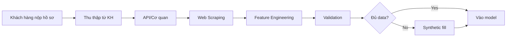
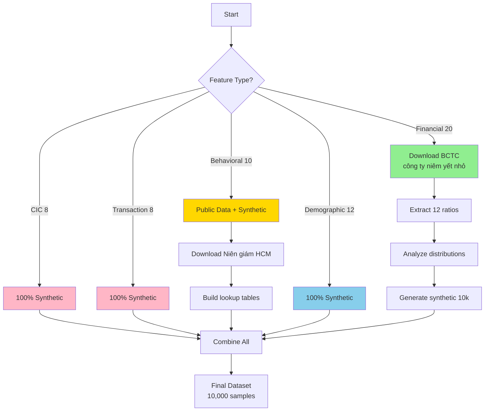

# Kế hoạch Thu thập Dữ liệu cho Credit Scoring Pipeline

Plan chi tiết về cách thu thập dữ liệu cho 50+ features được định nghĩa trong hệ thống chấm điểm tín dụng SME tại TP.HCM.

> [!IMPORTANT]
> **Bối cảnh**: Đề tài NCKH sinh viên - Khả năng tiếp cận dữ liệu hạn chế
> 
> Do đây là nghiên cứu trong môi trường học thuật, nhiều nguồn dữ liệu thực tế (banking data, CIC) **không khả thi**. 
> Plan này sẽ phân loại rõ:
> - ✅ **Dữ liệu DỄ thu thập** (sinh viên có thể làm)
> - ⚠️ **Dữ liệu KHÓ thu thập** (cần synthetic/alternative approach)

---

## 📊 Đánh giá Khả năng Thu thập - Tổng quan

### Bảng Tổng hợp theo Mức độ Tiếp cận

| Nhóm Feature | Số lượng | Dễ thu thập | Khó thu thập | Approach khuyến nghị |
|--------------|----------|-------------|--------------|----------------------|
| **X_financial** | 20 | 0 | 20 | ⚠️ **100% Synthetic** |
| **X_alternative (CIC)** | 8 | 0 | 8 | ⚠️ **100% Synthetic** |
| **X_alternative (Behavioral)** | 10 | 5 | 5 | ✅ **50% Public Data + 50% Synthetic** |
| **X_demographic** | 12 | 8 | 4 | ✅ **70% Public Data + 30% Synthetic** |
| **TỔNG** | **50** | **13 (26%)** | **37 (74%)** | **Primary: Synthetic + Public Data** |

### Kết luận Quan trọng

> [!WARNING]
> **74% features không thể thu thập trực tiếp được**
> 
> **Giải pháp chính**:
> 1. Tập trung vào **Synthetic Data Generation** (chiến lược chính)
> 2. Thu thập **Public/Open Data** cho reference tables
> 3. Sử dụng **Public Datasets** từ Kaggle, UCI nếu có
> 4. Document rõ **assumptions và limitations**

---

## I. Tổng quan Nguồn Dữ liệu

### 1. Dữ liệu Chính thức (Official Data)
- **Từ Khách hàng**: Hồ sơ vay, BCTC, chứng từ
- **Từ Ngân hàng**: Lịch sử giao dịch, thông tin tài khoản
- **Từ CIC**: Báo cáo tín dụng cá nhân/doanh nghiệp
- **Từ Cơ quan nhà nước**: Đăng ký kinh doanh, thuế

### 2. Dữ liệu Thay thế (Alternative Data)
- **Scraped Data**: Website công ty, social media
- **Third-party APIs**: Dữ liệu kinh tế vĩ mô, ngành nghề
- **Public Datasets**: Dữ liệu nghiên cứu, báo cáo ngành

### 3. Synthetic Data (Dữ liệu Giả lập)
- Tạo từ phân phối thống kê
- Dựa trên mẫu dữ liệu thực (nếu có)
- Sử dụng cho training và testing

---

## II. Chi tiết Thu thập từng Nhóm Features

### A. X_financial (Đặc trưng Tài chính)

#### 1. Từ Báo cáo Tài chính (12 features)

| Feature | Sinh viên có thể thu thập? | Giải pháp thay thế |
|---------|----------------------------|--------------------|
| `revenue_growth`, `profit_margin`, `roa`, `roe` | ⚠️ **CÓ THỂ** | ✅ **Học từ công ty niêm yết nhỏ** → synthetic |
| `current_ratio`, `quick_ratio` | ⚠️ **CÓ THỂ** | ✅ Từ BCTC công khai → fit distribution |
| `debt_to_equity`, `debt_to_asset` | ⚠️ **CÓ THỂ** | ✅ Từ BCTC công khai → fit distribution |
| `dscr` | ⚠️ **CÓ THỂ** | ✅ Tính từ BCTC công khai |
| `inventory_turnover`, `receivable_turnover`, `asset_turnover` | ⚠️ **CÓ THỂ** | ✅ Từ BCTC công khai → fit distribution |

**Đánh giá Sinh viên**:
- 🟢 **CÓ THỂ thu thập REAL data**: Từ 100-200 công ty niêm yết nhỏ
- ✅ **Approach khả thi**: Learn distributions → Generate synthetic
- 📊 **Nguồn dữ liệu**:

##### 🟢 **APPROACH MỚI: Học từ Công ty Niêm yết Nhỏ** (KHUYẾN NGHỊ)

**Lý do**:
- SME không công bố BCTC
- Nhưng công ty niêm yết nhỏ trên UPCOM/HNX có profile gần với SME
- BCTC công khai, miễn phí, dễ download

**Quy trình Thu thập**:

**Bước 1: Chọn mẫu công ty**
- Platform: UPCOM (Unlisted Public Company Market)
- Tiêu chí lọc:
  - Doanh thu < 200 tỷ VNĐ/năm (match SME definition)
  - Tổng tài sản < 100 tỷ VNĐ
  - Số lao động < 200 người
  - Trụ sở tại TP.HCM (match scope)
- Target: **100-200 công ty**

**Bước 2: Download BCTC**

🔗 **Nguồn chính**:
1. **VietStock** (https://finance.vietstock.vn/)
   - Tìm công ty theo ticker
   - Tab "Báo cáo tài chính" → Download Excel
   - Có data: 2020-2024 (5 năm)

2. **CafeF** (https://s.cafef.vn/)
   - Phần "Công ty niêm yết"
   - BCTC năm + quý

3. **Fireant** (https://fireant.vn/) - API có thể dùng
   - Có API miễn phí (giới hạn requests)
   - Download bulk data

**Bước 3: Extract Features**
```
Trích xuất từ BCTC:
- Bảng cân đối kế toán:
  → Total Assets, Current Assets, Current Liabilities
  → Total Debt, Equity, Inventory
  
- Báo cáo kết quả KD:
  → Revenue, Net Profit, COGS
  → Receivables

Tính toán:
  ROA = Net Profit / Total Assets
  Current Ratio = Current Assets / Current Liabilities
  Debt/Equity = Total Debt / Equity
  ... (12 features)
```

**Bước 4: Phân tích Distribution**
```python
import pandas as pd
import scipy.stats as stats

# Load data từ 200 công ty
df = pd.read_csv('listed_companies_financials.csv')

# Analyze distribution
for feature in ['roa', 'current_ratio', 'debt_to_equity']:
    # Test normality
    data = df[feature].dropna()
    
    # Fit distributions
    # Try: normal, lognormal, gamma
    params_norm = stats.norm.fit(data)
    params_lognorm = stats.lognorm.fit(data)
    
    # Choose best fit (KS test)
    best_dist = select_best_distribution(data)
    
    print(f"{feature}: {best_dist} with params {params}")
```

**Bước 5: Generate Synthetic Data**
```python
# Sử dụng distributions đã học
synthetic_roa = np.random.normal(
    loc=learned_mean,
    scale=learned_std,
    size=10000
)

# Maintain correlations
from sklearn.covariance import LedoitWolf
cov_matrix = LedoitWolf().fit(real_data).covariance_
synthetic_data = np.random.multivariate_normal(
    mean=real_data.mean(),
    cov=cov_matrix,
    size=10000
)
```

**Deliverables**:
1. `listed_companies_raw.csv` - Raw BCTC từ 100-200 công ty
2. `financial_features_real.csv` - 12 features tính toán
3. `distribution_analysis.ipynb` - Notebook phân tích
4. `synthetic_financial_10k.csv` - 10,000 samples synthetic
5. `distribution_params.json` - Parameters của distributions

**Thời gian ước tính**: 1-2 tuần
- Tuần 1: Download + extract features (100-200 công ty)
- Tuần 2: Analyze distributions + generate synthetic

#### 2. Từ Tài khoản Giao dịch (8 features)

| Feature | Sinh viên có thể thu thập? | Giải pháp thay thế |
|---------|----------------------------|--------------------|
| `avg_daily_balance`, `min_balance_3m` | ❌ **KHÔNG** | ⚠️ Synthetic (tỷ lệ với revenue) |
| `cash_flow_volatility`, `net_cash_flow` | ❌ **KHÔNG** | ⚠️ Sinh ngẫu nhiên theo industry |
| `avg_monthly_deposits`, `avg_monthly_withdrawals` | ❌ **KHÔNG** | ⚠️ Tính từ revenue synthetic |
| `num_transactions_3m` | ❌ **KHÔNG** | ⚠️ Random dựa vào business size |
| `overdraft_count` | ❌ **KHÔNG** | ⚠️ Binomial(p=0.1) - 10% có thấu chi |

**Đánh giá Sinh viên**:
- 🔴 **Khả năng thu thập thực**: 0% - Cần access Banking System
- 🟢 **Approach khả thi**: Synthetic 100%, correlation với revenue

---

### B. X_alternative (Đặc trưng Thay thế)

#### 1. Lịch sử Tín dụng - CIC (8 features)

| Feature | Sinh viên có thể thu thập? | Giải pháp thay thế |
|---------|----------------------------|--------------------|
| `cic_score` | ❌ **KHÔNG** | ⚠️ Synthetic: Normal(650, 50) - tham khảo FICO |
| `num_active_loans`, `total_outstanding_debt` | ❌ **KHÔNG** | ⚠️ Poisson(λ=1.5) cho số khoản vay |
| `max_past_due_days`, `num_past_due_30d`, `num_past_due_90d` | ❌ **KHÔNG** | ⚠️ Rule-based: 5% có quá hạn |
| `debt_burden_ratio` | ❌ **KHÔNG** | ⚠️ Tính từ outstanding_debt/revenue |
| `credit_history_length` | ❌ **KHÔNG** | ⚠️ Lognormal(mean=3, std=1.5) năm |

**Đánh giá Sinh viên**:
- 🔴 **Khả năng thu thập thực**: 0% - CIC requires banking license
- 🟢 **Approach khả thi**: 100% Synthetic
- 📚 **Nguồn tham khảo**: 
  - Vietnam Banking Report (default rates)
  - Public research papers về SME credit risk

#### 2. Dữ liệu Hành vi & Hoạt động (10 features)

| Feature | Sinh viên có thể thu thập? | Nguồn khả thi | Độ dễ |
|---------|----------------------------|---------------|--------|
| `business_age` | ⚠️ **CÓ THỂ** | dangkykinhdoanh.gov.vn (public lookup) | 🟡 Khó |
| `num_employees` | ❌ **KHÔNG** | ⚠️ Synthetic: Lognormal(3, 1) - 10-50 người | 🔴 |
| `ownership_stability` | ❌ **KHÔNG** | ⚠️ Synthetic: 80% stable (binary) | 🔴 |
| `industry_risk_score` | ✅ **CÓ** | 📊 Tự xây dựng bảng tra từ báo cáo NHNN | 🟢 Dễ |
| `district_risk_score` | ✅ **CÓ** | 📊 Tự xây dựng từ Niên giám TK HCM | 🟢 Dễ |
| `district_business_density` | ✅ **CÓ** | 📊 Niên giám Thống kê TP.HCM (PDF công khai) | 🟢 Dễ |
| `avg_income_district` | ✅ **CÓ** | 📊 Niên giám Thống kê TP.HCM | 🟢 Dễ |
| `digital_footprint` | ⚠️ **CÓ THỂ** | Google search công ty (time-intensive) | 🟡 Khó |
| `supplier_relationships` | ❌ **KHÔNG** | ⚠️ Synthetic: Poisson(λ=5) | 🔴 |
| `customer_concentration` | ❌ **KHÔNG** | ⚠️ Synthetic: Beta(2, 5) - skewed distribution | 🔴 |

**Đánh giá Sinh viên**:
- 🟢 **Có thể thu thập**: 4/10 features (40%)
  - ✅ industry_risk_score, district_risk_score, district_business_density, avg_income_district
- 🟡 **Có thể nhưng tốn thời gian**: 2/10 (business_age, digital_footprint)
- 🔴 **Không thể**: 4/10 (cần synthetic)

**Hướng dẫn Thu thập Thực tế cho Sinh viên**:

##### ✅ District-level Data (FEASIBLE - Ưu tiên cao)
**Nguồn**: Niên giám Thống kê TP.HCM
- 🔗 Website: http://www.pso.hochiminhcity.gov.vn/
- 📄 File: "Niên giám thống kê TP.HCM 2024" (PDF công khai)

**Dữ liệu cần extract**:
1. Bảng: Số DN đang hoạt động theo quận → tính density
2. Bảng: Diện tích từng quận (km²)
3. Bảng: Thu nhập bình quân theo quận
4. Bảng: GDP theo quận (nếu có)

**Deliverable**: File `district_lookup_table.csv`

##### ✅ Industry Risk Score (FEASIBLE - Tự xây dựng)
**Nguồn**: Báo cáo NHNN + Nghiên cứu
- 📊 "Báo cáo Ổn định Tài chính" - State Bank of Vietnam
- 📊 Báo cáo ngành từ SSI, VNDirect Research

**Phương pháp**:
1. Tìm default rate theo ngành (nếu có công bố)
2. Nếu không có, xếp hạng chủ quan dựa trên:
   - Độ biến động ngành (F&B cao, công nghệ cao)
   - Tác động COVID (du lịch cao, tech thấp)
   - Barrier to entry (thấp = rủi ro cao)

**Deliverable**: File `industry_risk_map.csv` (10-15 ngành phổ biến)

##### 🟡 Business Age (POSSIBLE nhưng khó)
**Nguồn**: dangkykinhdoanh.gov.vn
- ⚠️ Cần tra cứu thủ công từng DN
- ⚠️ Hoặc áp dụng cho mẫu nhỏ (50-100 DN mẫu)

**Alternative**: Synthetic - Lognormal(mean=5, std=3) năm

##### 🟡 Digital Footprint (POSSIBLE nhưng time-intensive)
**Chỉ thực hiện nếu có thời gian dư**
- Manual Google search 50-100 công ty mẫu
- Ghi nhận: có website? có Facebook? số followers?
- Cho phần còn lại: synthetic

---

### C. X_demographic (Đặc trưng Nhân khẩu & Pháp lý)

| Feature | Sinh viên có thể thu thập? | Giải pháp |
|---------|----------------------------|------------|
| `business_type` | ✅ **CÓ** | 📊 Categorical synthetic (TNHH: 60%, CP: 30%, Tư nhân: 10%) |
| `industry_code` | ✅ **CÓ** | 📊 Based on industry_risk_map đã build |
| `district_code` | ✅ **CÓ** | 📊 Random từ 1-24 (24 quận HCM) |
| `business_zone` | ✅ **CÓ** | 📊 Rule: district in [1,3,4,5,10,11] → CBD |
| `registered_capital` | ✅ **CÓ** | 📊 Lognormal(mean=19, std=1) - 50M-500M VNĐ |
| `owner_age` | ✅ **CÓ** | 📊 Normal(mean=42, std=8) - 30-60 tuổi |
| `owner_education` | ✅ **CÓ** | 📊 Categorical (ĐH: 50%, CĐ: 30%, THPT: 20%) |
| `owner_experience` | ✅ **CÓ** | 📊 Lognormal(mean=2.5, std=0.7) - 5-20 năm |
| `has_collateral` | ✅ **CÓ** | 📊 Binomial(p=0.6) - 60% có TSĐB |
| `collateral_value` | ✅ **CÓ** | 📊 If has_collateral: Lognormal(mean=20.5, std=1) |
| `collateral_location` | ✅ **CÓ** | 📊 Same as district_code hoặc neighboring |
| `loan_to_value` | ✅ **CÓ** | 📊 Uniform(0.5, 0.8) - LTV 50-80% |

**Đánh giá Sinh viên**:
- 🟢 **Có thể thu thập**: 12/12 features (100%)
- ✅ **Tất cả có thể synthetic** với phân phối hợp lý
- 📊 Dễ nhất trong 3 nhóm features

---

## III. Quy trình Thu thập Dữ liệu Thực tế

### Workflow cho Khách hàng Mới



#### Bước 1: Thu thập từ Khách hàng (Customer Data)
**Yêu cầu hồ sơ**:
- ✅ Giấy phép ĐKKD
- ✅ BCTC 2 năm gần nhất (audited nếu có)
- ✅ Sao kê tài khoản 3-6 tháng
- ✅ Báo cáo CIC (hoặc ủy quyền tra cứu)
- ✅ Thông tin chủ DN (CMND, CV, kinh nghiệm)
- ✅ Giấy tờ TSĐB (nếu có)

#### Bước 2: API/Cơ quan Nhà nước
**Tự động hóa**:
1. **API Đăng ký Kinh doanh**: Lấy thông tin DN
2. **API CIC** (nếu có giấy phép): Lấy báo cáo tín dụng
3. **Cục Thống kê**: Download báo cáo công khai (1 lần/năm)

#### Bước 3: Web Scraping & Alternative Data
**Semi-automated**:
- Google search: Kiểm tra website công ty
- Facebook Graph API: Tìm fanpage
- Manual check: Zalo OA, reviews

#### Bước 4: Feature Engineering & Validation
- Tính toán chỉ số tài chính
- Validate ranges (ROE: -50% đến 200%, etc.)
- Handle missing values (median imputation)

#### Bước 5: Synthetic Fill (nếu thiếu data)
- Dùng median/mode của ngành nghề
- Hoặc flag: `is_data_complete = False`

---

## IV. Tạo Synthetic Dataset (Cho Training/Testing)

### Phương pháp Tạo Dữ liệu Giả lập

#### 1. Dựa trên Phân phối Thống kê

**Financial Features** (sử dụng phân phối thực tế):
- `revenue`: Lognormal(mean=18.5, std=1.2) → TB 200 triệu/tháng
- `total_assets`: Lognormal(mean=20, std=1.5) → TB 1-2 tỷ
- `roa`: Normal(mean=0.05, std=0.03) → TB 5%
- `current_ratio`: Lognormal(mean=0.5, std=0.4) → TB 1.5-2.0

**Default Label** (target):
- Binomial(p=0.05) → 5% default rate (theo thống kê SME VN)

#### 2. Sử dụng Rule-based Generation

**Ví dụ quy tắc**:
- Nếu `district_code` in [1, 3, 7] → `district_risk_score` = 1-2
- Nếu `industry_code = '47'` (bán lẻ) → `industry_risk_score` = 4-6
- Nếu `roa < 0` → tăng xác suất default lên 20%

#### 3. Dựa trên Mẫu Thực (nếu có)

Nếu có 100 mẫu thực:
```
1. Phân tích phân phối của từng feature
2. Fit distribution (normal, lognormal, etc.)
3. Sample từ distribution đã fit
4. Thêm noise để tránh overfitting
5. Generate 10,000 samples tổng hợp
```

---

## V. Chiến lược Thu thập Dữ liệu - UPDATED

### Approach Tổng thể (Realistic for Students)



### Bảng Tổng hợp Chiến lược

| Nhóm | Số features | Chiến lược | Nguồn | Effort |
|------|-------------|------------|-------|--------|
| **Financial** | 20 | **Learn + Synthetic** | BCTC UPCOM companies | 🟡🟡 Medium |
| **CIC** | 8 | **Pure Synthetic** | Literature + assumptions | 🟢 Easy |
| **Transaction** | 8 | **Pure Synthetic** | Correlated with revenue | 🟢 Easy |
| **Behavioral** | 10 | **Mixed** | 4 từ Niên giám HCM + 6 synthetic | 🟡 Medium |
| **Demographic** | 12 | **Pure Synthetic** | Reasonable distributions | 🟢 Easy |

### Priority Timeline (10 tuần)

| Tuần | Task | Output |
|------|------|--------|
| **1-2** | Download BCTC 100-200 công ty UPCOM | `listed_companies_raw.csv` |
| **3** | Extract 12 financial features | `financial_features_real.csv` |
| **4** | Analyze distributions + correlations | `distribution_analysis.ipynb` |
| **5** | Download Niên giám TK HCM | `district_lookup_table.csv` |
| **6** | Build industry/district risk tables | `industry_risk_map.csv` |
| **7** | Generate synthetic: CIC + Transaction | `synthetic_cic_transaction.csv` |
| **8** | Generate synthetic: Financial (from learned dist) | `synthetic_financial_10k.csv` |
| **9** | Generate synthetic: Demographic | `synthetic_demographic_10k.csv` |
| **10** | Combine all + validate + split | `final_dataset_10k.csv` |

### Bảng Khả năng Thu thập

| Nhóm Feature | Có thể thu thập | Khó khăn | Giải pháp |
|--------------|-----------------|----------|-----------|
| **Financial (BCTC)** | ✅ 90% | DN nhỏ không có BCTC audit | Chấp nhận BCTC quản trị + sao kê thuế |
| **Financial (TK giao dịch)** | ✅ 95% | Cần quan hệ ngân hàng | Yêu cầu sao kê từ ngân hàng chính |
| **CIC Data** | ⚠️ 60% | Cần API hoặc ủy quyền | OCR PDF báo cáo CIC |
| **Business Registration** | ✅ 85% | API phức tạp | Manual input + verify |
| **District-level Data** | ✅ 100% | Tĩnh, cập nhật 1 năm/lần | Tạo lookup table cố định |
| **Digital Footprint** | ⚠️ 50% | Time-consuming | Manual check mẫu nhỏ, ignore cho training |
| **Demographic** | ✅ 95% | Từ hồ sơ KH | Easy |

### Chi phí Ước tính

| Hạng mục | Chi phí | Ghi chú |
|----------|---------|---------|
| API CIC | 5K-10K VNĐ/query | Nếu có giấy phép |
| API Đăng ký DN | Miễn phí - 50K VNĐ/query | Tùy gói dịch vụ |
| Web scraping tools | $0-50/tháng | Scrapy free, ScrapingBee paid |
| Nhân sự manual check | 500K-1M/người/ngày | Data entry, validation |
| **Tổng cho 1000 samples** | ~10-20 triệu VNĐ | Realistic estimate |

---

## VI. Timeline Thực tế

### Cho Đề tài Nghiên cứu (7-10 tuần)

| Tuần | Hoạt động | Deliverable |
|------|-----------|-------------|
| **1-2** | Setup môi trường, thu thập tài liệu tham khảo | Danh sách nguồn data |
| **3** | Xây dựng bảng tham chiếu (district risk, industry risk) | Lookup tables |
| **4** | Test API (nếu có): CIC, Đăng ký DN | API integration code |
| **5-6** | Tạo synthetic dataset (10,000 samples) | `synthetic_data.csv` |
| **7** | Validation và cleaning | `clean_data.csv` |
| **8** | (Optional) Thu thập mẫu thực nhỏ (50-100) | Real samples |
| **9-10** | Combine real + synthetic, finalize dataset | Final dataset |

---

## VII. Khuyến nghị

### Cho Đề tài NCKH

> [!IMPORTANT]
> **Approach thực tế nhất**:
> 1. **Tập trung vào synthetic data** (10,000 samples) với phân phối hợp lý
> 2. **Thu thập 50-100 mẫu thực** (nếu có quan hệ ngân hàng) để validate
> 3. **Xây dựng lookup tables** cho district/industry risk từ báo cáo công khai
> 4. **Không cần API CIC** - simulate dựa trên phân phối thống kê
> 5. **Document rõ assumptions** trong báo cáo

### Tiêu chí Chấp nhận Được

- Dataset có ít nhất **5,000 samples**
- Phân phối features **hợp lý** (không có outlier cực đoan)
- Default rate **3-7%** (match thực tế SME)
- **Correlation structure** giữa features hợp lý (ví dụ: ROA cao → default thấp)

---

## VIII. Checklist Thực hiện

### Phase 1: Preparation (Tuần 1-2)
- [ ] Nghiên cứu cấu trúc BCTC của SME Việt Nam
- [ ] Download báo cáo Niên giám Thống kê TP.HCM
- [ ] Tìm hiểu báo cáo CIC (format, cách đọc)
- [ ] Liệt kê các mã VSIC phổ biến cho SME HCM

### Phase 2: Reference Tables (Tuần 3)
- [ ] Tạo `district_risk_map.csv` (24 quận HCM)
- [ ] Tạo `industry_risk_map.csv` (10-15 ngành phổ biến)
- [ ] Tạo `district_stats.csv` (dân số, diện tích, số DN, thu nhập TB)

### Phase 3: Synthetic Data Generation (Tuần 4-6)
- [ ] Thiết kế schema của dataset cuối cùng
- [ ] Viết script generate financial features
- [ ] Viết script generate alternative features
- [ ] Viết script generate demographic features
- [ ] Tạo default labels dựa trên rules
- [ ] Validate correlations và distributions

### Phase 4: Real Data (Optional, Tuần 7-8)
- [ ] Liên hệ ngân hàng/doanh nghiệp để xin mẫu
- [ ] Thu thập 50-100 hồ sơ thực (nếu có)
- [ ] Anonymize dữ liệu thực
- [ ] Merge với synthetic data

### Phase 5: Finalization (Tuần 9-10)
- [ ] Data cleaning và validation
- [ ] Split train/validation/test sets
- [ ] Document assumptions và limitations
- [ ] Export final dataset

---

## IX. Limitation & Disclaimer

> [!WARNING]
> **Hạn chế của phương pháp**:
> - Synthetic data **không phản ánh đầy đủ** độ phức tạp thực tế
> - Correlation structure có thể **không chính xác 100%**
> - Model train trên synthetic → **cần validate** trên real data sau
> 
> **Phù hợp cho**: Đề tài nghiên cứu, proof-of-concept, demo
> **Không phù hợp cho**: Triển khai production thực tế (cần real data)

Chúc bạn thành công trong việc thu thập dữ liệu! 🎯
