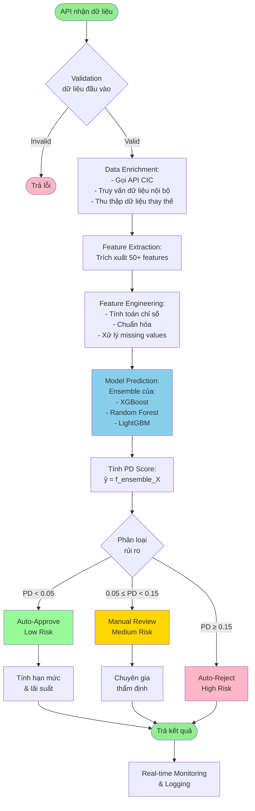
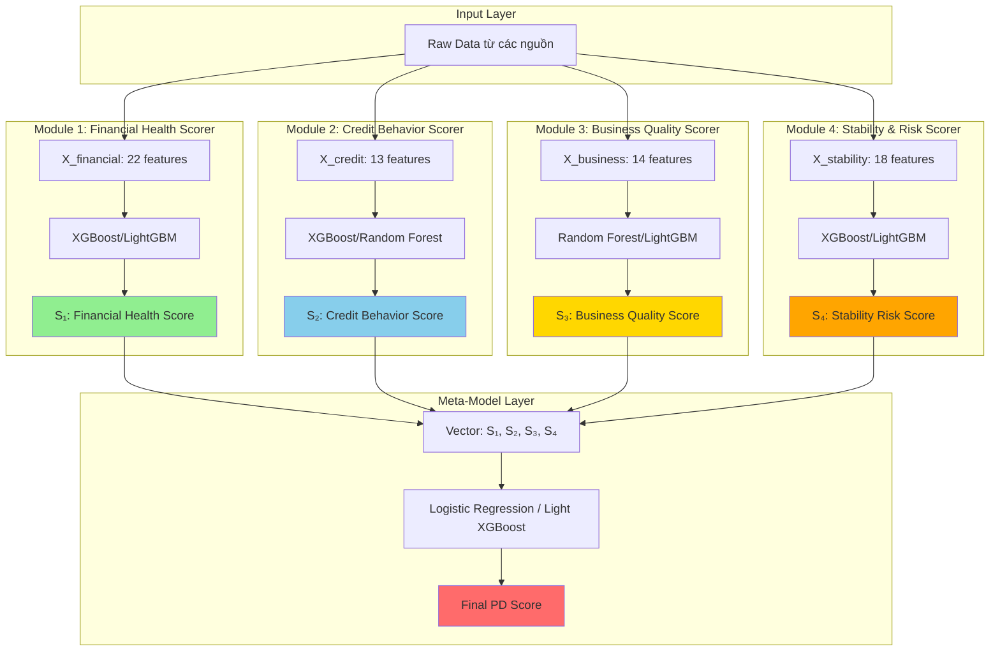
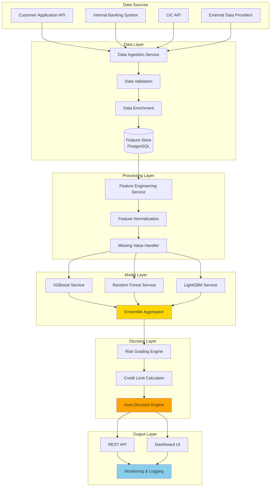
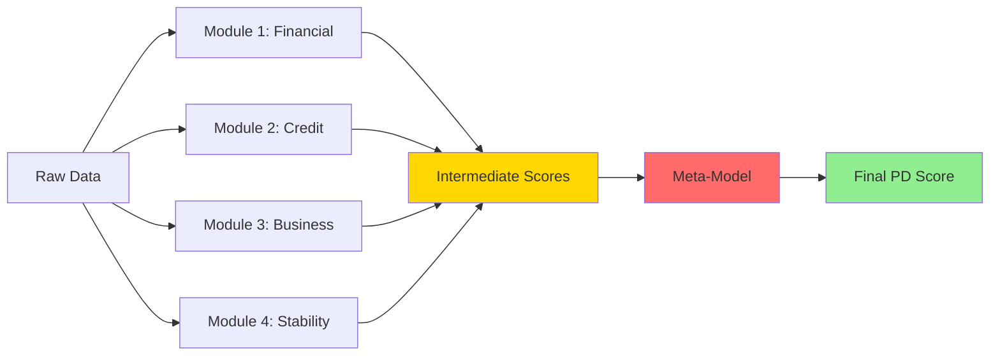

# Stage 2: Automated Credit Scoring Pipeline - Implementation Plan (Modular Architecture)

Kế hoạch thiết kế hệ thống chấm điểm tín dụng tự động cho SME với **kiến trúc modular** 4 tầng, khả năng xử lý thời gian thực và mở rộng.

> [!NOTE]
> **Vai trò tài liệu**: Đây là kế hoạch tư vấn (advisory plan). Người thực hiện sẽ tự triển khai dựa trên hướng dẫn này.

> [!IMPORTANT]
> **Cập nhật quan trọng**: Plan này đã được cập nhật để áp dụng **Modular Architecture** với 4 scoring modules độc lập, dựa trên thực tiễn thẩm định tín dụng DN nhỏ tại Việt Nam. Kiến trúc này giúp:
> - Xử lý tốt hơn khi thiếu dữ liệu
> - Dễ debug và maintain
> - Tăng khả năng giải thích (explainability)
> - Linh hoạt trong việc mở rộng

## Phạm vi & Ràng buộc Hệ thống

### Giới hạn Địa lý
- **Khu vực**: Chỉ áp dụng cho **Thành phố Hồ Chí Minh**
- **Lý do**: Đề tài nghiên cứu tập trung vào các ngân hàng thương mại tại TP.HCM
- **Impact**: 
  - Dữ liệu địa lý (province_code) sẽ cố định là HCMC
  - Có thể tận dụng dữ liệu kinh tế vĩ mô đặc thù của TP.HCM
  - Location risk score có thể chi tiết đến cấp quận/huyện trong HCM

### Giới hạn Ngành nghề
- **Scope hiện tại**: **Chưa giới hạn ngành nghề cụ thể**
- **Recommend**: Khi triển khai thực tế, nên ưu tiên các ngành:
  - Thương mại (Bán lẻ, Bán sỉ)
  - Sản xuất quy mô nhỏ
  - Dịch vụ (F&B, Logistics)
  - Xuất nhập khẩu

### Quy mô SME
- Doanh nghiệp vừa và nhỏ theo Nghị định 39/2018/NĐ-CP
- Doanh thu: < 200 tỷ VNĐ/năm
- Số lao động: < 200 người

## Mục tiêu toán học

### Kiến trúc Modular 2-tầng

**Tầng 1: Specialized Scoring Modules**

Tìm 4 hàm ánh xạ chuyên biệt:

```
S₁ = f₁(X_financial)           → Financial Health Score [0,1]
S₂ = f₂(X_credit)              → Credit Behavior Score [0,1]  
S₃ = f₃(X_business)            → Business Quality Score [0,1]
S₄ = f₄(X_stability)           → Stability & Risk Score [0,1]
```

**Tầng 2: Meta-Ensemble Model**

Tìm hàm kết hợp tối ưu:

```
ŷ = f_meta(S₁, S₂, S₃, S₄)     → Probability of Default [0,1]
```

Trong đó:
- **ŷ**: Xác suất vỡ nợ (Probability of Default - PD)
- **S₁-S₄**: Điểm số trung gian từ 4 modules chuyên biệt
- **X**: Các vector đặc trưng đã được số hóa, được nhóm theo domain

**Ưu điểm kiến trúc này:**
- ✅ Xử lý robust khi thiếu dữ liệu (module nào thiếu data vẫn có thể dùng default score)
- ✅ Explainable: Có thể phân tích từng khía cạnh riêng biệt
- ✅ Maintainable: Update/retrain từng module độc lập
- ✅ Scalable: Dễ dàng thêm modules mới (VD: Social Media Score)

---

## 1. Quy trình Thẩm định Tín dụng Chuẩn (Thực tế)

### Flowchart Quy trình Truyền thống


### Các điểm ra quyết định chính

1. **Khảo sát ban đầu**: Lọc sơ bộ khách hàng không đủ điều kiện
2. **Xác minh hồ sơ**: Kiểm tra tính đầy đủ và hợp lệ
3. **Phân tích chỉ số tài chính**: Đánh giá năng lực tài chính
4. **Lịch sử tín dụng**: Kiểm tra CIC, nợ xấu
5. **Tài sản đảm bảo**: Thẩm định giá trị TSĐB
6. **Hội đồng tín dụng**: Quyết định cuối cùng

### Thời gian xử lý truyền thống: **5-15 ngày làm việc**

---

## 2. Quy trình Thẩm định Tín dụng Tự động

### Flowchart Quy trình Tự động hóa



### Thời gian xử lý tự động: **< 5 phút** (Near Real-time)

---

## 3. Kiến trúc Modular và Phân bổ Đặc trưng

### Tổng quan Kiến trúc

Hệ thống sử dụng **4 Scoring Modules** chuyên biệt, mỗi module tập trung vào một khía cạnh của credit risk:



### 3.1. Module 1: Financial Health Scorer

**Mục đích:** Đánh giá sức khỏe tài chính và khả năng sinh lời của doanh nghiệp

**Input Features (22 features):**

#### Từ Báo cáo tài chính (12 features)

| Feature | Công thức | Ý nghĩa |
|---------|-----------|---------|
| `revenue_growth` | `(Doanh thu năm n - Doanh thu năm n-1) / Doanh thu năm n-1` | Tốc độ tăng trưởng |
| `profit_margin` | `Lợi nhuận ròng / Doanh thu` | Khả năng sinh lời |
| `roa` | `Lợi nhuận ròng / Tổng tài sản` | Hiệu quả sử dụng tài sản |
| `roe` | `Lợi nhuận ròng / Vốn chủ sở hữu` | Hiệu suất vốn |
| `current_ratio` | `Tài sản ngắn hạn / Nợ ngắn hạn` | Khả năng thanh toán |
| `quick_ratio` | `(TSNH - Hàng tồn kho) / Nợ ngắn hạn` | Thanh khoản nhanh |
| `debt_to_equity` | `Tổng nợ / Vốn chủ sở hữu` | Đòn bẩy tài chính |
| `debt_to_asset` | `Tổng nợ / Tổng tài sản` | Tỷ lệ nợ |
| `dscr` | `EBITDA / Tổng nghĩa vụ nợ hàng năm` | Khả năng trả nợ |
| `inventory_turnover` | `Giá vốn hàng bán / Hàng tồn kho TB` | Hiệu quả quản lý HTK |
| `receivable_turnover` | `Doanh thu / Khoản phải thu TB` | Hiệu quả thu hồi công nợ |
| `asset_turnover` | `Doanh thu / Tổng tài sản` | Hiệu quả sử dụng TS |

#### Từ Dòng tiền (10 features)

| Feature | Mô tả | Công thức |
|---------|-------|-----------|
| `free_cash_flow` | Dòng tiền tự do | `OCF - CapEx` |
| `operating_cash_flow_ratio` | Tỷ lệ dòng tiền hoạt động | `OCF / Current Liabilities` |
| `cash_conversion_cycle` | Chu kỳ chuyển đổi tiền | `DSO + DIO - DPO` |
| `days_sales_outstanding` | Số ngày bán chịu (DSO) | `(Phải thu / Doanh thu) × 360` |
| `days_payables_outstanding` | Số ngày mua chịu (DPO) | `(Phải trả / COGS) × 360` |
| `avg_daily_balance` | Số dư bình quân ngày (3 tháng) | `Σ(Số dư cuối ngày) / Số ngày` |
| `min_balance_3m` | Số dư thấp nhất 3 tháng | `min(số dư)` |
| `cash_flow_volatility` | Độ biến động dòng tiền | `std(dòng tiền hàng ngày)` |
| `net_cash_flow` | Dòng tiền ròng TB/tháng | `avg_deposits - avg_withdrawals` |
| `overdraft_count` | Số lần thấu chi | `count(balance < 0)` |

**Output:** `financial_health_score` (0-1)

---

### 3.2. Module 2: Credit Behavior Scorer

**Mục đích:** Đánh giá lịch sử tín dụng và hành vi trả nợ

**Input Features (13 features):**

#### Từ CIC (Credit Information Center)

| Feature | Mô tả |
|---------|-------|
| `cic_score` | Điểm CIC (nếu có) |
| `num_active_loans` | Số khoản vay đang có |
| `total_outstanding_debt` | Tổng dư nợ hiện tại |
| `max_past_due_days` | Số ngày quá hạn cao nhất (12 tháng) |
| `num_past_due_30d` | Số lần quá hạn > 30 ngày (12 tháng) |
| `num_past_due_90d` | Số lần quá hạn > 90 ngày (12 tháng) |
| `debt_burden_ratio` | `Tổng dư nợ / Doanh thu tháng` |
| `credit_history_length` | Số năm có quan hệ tín dụng |
| `previous_default_history` | Binary: Có lịch sử vỡ nợ (1=Có, 0=Không) |

#### Từ Transaction Patterns

| Feature | Mô tả |
|---------|-------|
| `num_transactions_3m` | Số giao dịch 3 tháng |
| `avg_monthly_deposits` | Tiền gửi TB/tháng |
| `avg_monthly_withdrawals` | Tiền rút TB/tháng |
| `transaction_regularity_score` | Điểm đều đặn giao dịch (0-1) |

**Output:** `credit_behavior_score` (0-1)

---

### 3.3. Module 3: Business Quality Scorer

**Mục đích:** Đánh giá chất lượng doanh nghiệp, năng lực người điều hành, và competitive advantage

**Input Features (14 features):**

#### Năng lực Người điều hành

| Feature | Mô tả | Kiểu |
|---------|-------|------|
| `owner_age` | Tuổi chủ doanh nghiệp | Numeric |
| `owner_education` | Trình độ học vấn | Categorical (1-5) |
| `owner_experience` | Số năm kinh nghiệm | Numeric |

#### Chất lượng Sản phẩm & Cạnh tranh

| Feature | Mô tả | Kiểu |
|---------|-------|------|
| `product_differentiation_score` | Mức độ khác biệt sản phẩm | Numeric (1-10) |
| `industry_competition_intensity` | Cường độ cạnh tranh ngành | Numeric (1-10) |

#### Quan hệ Kinh doanh

| Feature | Mô tả |
|---------|-------|
| `supplier_relationships` | Số nhà cung cấp chính |
| `customer_concentration` | Tỷ trọng KH lớn nhất / Doanh thu |
| `digital_footprint` | Mức độ hiện diện số (website, social) |

#### Năng lực Hoạt động

| Feature | Mô tả | Công thức |
|---------|-------|-----------|
| `business_age` | Số năm hoạt động | Numeric |
| `num_employees` | Số lượng nhân viên | Numeric |
| `employee_productivity_score` | Năng suất nhân viên | `Doanh thu / Số nhân viên` |
| `revenue_capacity_ratio` | Tỷ lệ doanh thu/công suất | `Doanh thu thực tế / Doanh thu lý thuyết` |
| `financial_data_reliability_score` | Độ tin cậy dữ liệu tài chính | Numeric (0-1) |

**Output:** `business_quality_score` (0-1)

---

### 3.4. Module 4: Stability & Risk Scorer

**Mục đích:** Đánh giá tính ổn định và các rủi ro từ môi trường, lịch sử, và tài sản đảm bảo

**Input Features (18 features):**

#### Lịch sử & Ổn định

| Feature | Mô tả |
|---------|-------|
| `founding_year` | Năm thành lập |
| `years_at_current_location` | Số năm tại địa điểm hiện tại |
| `industry_changes_count` | Số lần đổi ngành nghề |
| `past_bankruptcy` | Binary: Lịch sử phá sản |
| `ownership_stability` | Tỷ lệ sở hữu ổn định (không đổi chủ) |

#### Rủi ro Ngành & Vùng (TP.HCM scope)

| Feature | Mô tả | Kiểu |
|---------|-------|------|
| `industry_code` | Mã ngành VSIC | Categorical |
| `industry_risk_score` | Điểm rủi ro ngành nghề | Numeric (1-10, tra bảng) |
| `industry_lifecycle_stage` | Giai đoạn chu kỳ | Categorical (Growth/Mature/Decline) |
| `district_code` | Mã quận/huyện TP.HCM | Categorical (24 quận) |
| `district_risk_score` | Điểm rủi ro theo quận | Numeric (1-10) |
| `business_zone` | Khu vực KD | Categorical (CBD/Suburban) |
| `district_business_density` | Mật độ DN trong quận | Numeric (DN/km²) |
| `avg_income_district` | Thu nhập bình quân quận | Numeric (VNĐ/tháng) |

#### Tài sản Đảm bảo

| Feature | Mô tả | Kiểu |
|---------|-------|------|
| `has_collateral` | Có TSĐB hay không | Binary |
| `collateral_value` | Giá trị TSĐB | Numeric |
| `loan_to_value` | `Hạn mức vay / Giá trị TSĐB` | Numeric |
| `collateral_liquidity_score` | Điểm thanh khoản TSĐB | Numeric (1-10) |
| `collateral_type` | Loại TSĐB | Categorical (Real Estate/Equipment/Other) |

**Output:** `stability_risk_score` (0-1)

---

### 3.5. Tổng hợp Features

| Module | Số lượng Features | Nguồn gốc chủ yếu |
|--------|-------------------|-------------------|
| **Module 1: Financial Health** | 22 | Định lượng (100%) |
| **Module 2: Credit Behavior** | 13 | Định lượng (100%) |
| **Module 3: Business Quality** | 14 | Hỗn hợp (60% định lượng, 40% định tính số hóa) |
| **Module 4: Stability & Risk** | 18 | Hỗn hợp (50% định lượng, 50% định tính số hóa) |
| **TỔNG CỘNG** | **67 features** | **~75% định lượng, ~25% định tính số hóa** |

---

## 4. Feature Engineering & Normalization

### 4.1. Biến đổi dữ liệu

#### Log Transform (cho biến lệch phải)
Áp dụng log transformation cho các biến có phân phối lệch phải như doanh thu, tổng tài sản, vốn điều lệ.

#### Tỷ lệ & Tương tác
Tạo các biến tương tác giữa các chỉ số tài chính để nắm bắt mối quan hệ phi tuyến.

### 4.2. Chuẩn hóa (Normalization)

#### Min-Max Scaling (cho features có phân phối đồng đều)
Scale các features về khoảng [0, 1].

#### Standardization (cho features có phân phối chuẩn)
```python
z = (x - μ) / σ
```

Chuẩn hóa features theo phân phối chuẩn với mean = 0, std = 1.

### 4.3. Xử lý Missing Values

- Median imputation cho numeric features
- Mode imputation cho categorical features
- Xem xét KNN imputation cho missing values có cấu trúc

---

## 5. Kiến trúc Mô hình (Modular Model Architecture)

### 5.1. Tier 1: Specialized Scoring Modules

Mỗi module sử dụng ensemble riêng biệt để tối ưu cho domain cụ thể.

#### Module 1: Financial Health Scorer

**Model Stack:**
```python
# Base Models
model_1a = XGBoost(
    objective='reg:squarederror',
    max_depth=5,
    learning_rate=0.05,
    n_estimators=200,
    subsample=0.8
)

model_1b = LightGBM(
    objective='regression',
    num_leaves=31,
    learning_rate=0.05,
    n_estimators=200
)

# Ensemble
financial_health_score = 0.6 * model_1a.predict(X_financial) + 
                         0.4 * model_1b.predict(X_financial)
```

**Hyperparameters:**
- Focus on financial ratios and cash flow metrics
- L2 regularization to prevent overfitting on financial data
- Feature importance: ROA, DSCR, Current Ratio, Free Cash Flow

---

#### Module 2: Credit Behavior Scorer

**Model Stack:**
```python
# Base Models
model_2a = XGBoost(
    objective='reg:squarederror',
    scale_pos_weight=3,  # Higher weight for default history
    max_depth=4,
    learning_rate=0.05,
    n_estimators=150
)

model_2b = RandomForest(
    n_estimators=200,
    max_depth=8,
    min_samples_split=5,
    class_weight='balanced'
)

# Ensemble
credit_behavior_score = 0.7 * model_2a.predict(X_credit) + 
                        0.3 * model_2b.predict(X_credit)
```

**Hyperparameters:**
- Heavier penalty cho past due features
- Feature importance: num_past_due_90d, max_past_due_days, debt_burden_ratio

---

#### Module 3: Business Quality Scorer

**Model Stack:**
```python
# Base Models with Categorical Encoding
encoder = TargetEncoder(cols=['owner_education', 'industry_code'])
X_business_encoded = encoder.fit_transform(X_business, y)

model_3a = RandomForest(
    n_estimators=250,
    max_depth=6,
    min_samples_split=10
)

model_3b = LightGBM(
    objective='regression',
    num_leaves=25,
    learning_rate=0.03,
    categorical_feature=['owner_education', 'industry_code']
)

# Ensemble
business_quality_score = 0.5 * model_3a predict(X_business_encoded) +
                         0.5 * model_3b.predict(X_business_encoded)
```

**Hyperparameters:**
- Categorical encoding cho education, industry
- Feature importance: owner_experience, employee_productivity, business_age

---

#### Module 4: Stability & Risk Scorer

**Model Stack:**
```python
# Base Models
model_4a = XGBoost(
    objective='reg:squarederror',
    max_depth=5,
    learning_rate=0.05,
    n_estimators=200
)

model_4b = LightGBM(
    objective='regression',
    num_leaves=31,
    learning_rate=0.05
)

# Ensemble with Risk Adjustment
base_score = 0.6 * model_4a.predict(X_stability) + 
             0.4 * model_4b.predict(X_stability)

# Apply collateral adjustment
if has_collateral:
    stability_risk_score = base_score * (1 + 0.1 * collateral_liquidity_score/10)
else:
    stability_risk_score = base_score * 0.9  # Penalty for no collateral
```

**Hyperparameters:**
- Feature importance: district_risk_score, industry_risk_score, collateral_liquidity
- Explicit handling cho collateral features

---

### 5.2. Tier 2: Meta-Ensemble Model

**Mục đích:** Kết hợp 4 intermediate scores từ specialized modules thành final PD score.

**Model Architecture:**

```python
# Input: 4 intermediate scores
X_meta = np.column_stack([
    financial_health_score,     # S₁
    credit_behavior_score,      # S₂
    business_quality_score,     # S₃
    stability_risk_score        # S₄
])

# Option 1: Weighted Logistic Regression (Recommended for Explainability)
meta_model = LogisticRegression(
    penalty='l2',
    C=1.0,
    class_weight='balanced',
    solver='lbfgs'
)

# Option 2: Light XGBoost (Better performance)
meta_model = XGBoost(
    objective='binary:logistic',
    max_depth=3,               # Shallow tree for interpretability
    learning_rate=0.1,
    n_estimators=50,
    subsample=0.8
)

# Train meta-model
meta_model.fit(X_meta, y_default)

# Final prediction
final_pd_score = meta_model.predict_proba(X_meta)[:, 1]
```

**Ưu điểm Meta-Model:**
- ✅ **Explainable**: Có thể phân tích contribution của từng module
- ✅ **Robust**: Nếu 1 module thiếu data, vẫn dùng 3 modules còn lại
- ✅ **Flexible**: Có thể điều chỉnh weights theo business rules

**Weights Analysis Example:**
```python
# Logistic Regression Coefficients
print(meta_model.coef_)
# Output: [0.35, 0.40, 0.15, 0.10]
# → Credit Behavior (40%) có impact cao nhất
# → Financial Health (35%) là yếu tố thứ 2
# → Business Quality (15%) và Stability (10%) là hỗ trợ
```

---

### 5.3. Hàm dự đoán cuối cùng

**Full Pipeline:**

```python
def predict_credit_risk(borrower_data):
    """
    End-to-end prediction pipeline
    
    Input: borrower_data (dict with all raw features)
    Output: {
        pd_score: float,
        risk_grade: str,
        module_scores: dict,
        recommendation: str,
        credit_limit: float
    }
    """
    
    # Step 1: Feature Engineering & Extraction
    X_financial = extract_financial_features(borrower_data)
    X_credit = extract_credit_features(borrower_data)
    X_business = extract_business_features(borrower_data)
    X_stability = extract_stability_features(borrower_data)
    
    # Step 2: Normalize features
    X_financial_norm = scaler_financial.transform(X_financial)
    X_credit_norm = scaler_credit.transform(X_credit)
    X_business_norm = scaler_business.transform(X_business)
    X_stability_norm = scaler_stability.transform(X_stability)
    
    # Step 3: Module-level predictions
    S1 = module_1.predict(X_financial_norm)  # Financial Health
    S2 = module_2.predict(X_credit_norm)     # Credit Behavior  
    S3 = module_3.predict(X_business_norm)   # Business Quality
    S4 = module_4.predict(X_stability_norm)  # Stability & Risk
    
    # Step 4: Meta-model prediction
    X_meta = np.array([[S1, S2, S3, S4]])
    pd_score = meta_model.predict_proba(X_meta)[0, 1]
    
    # Step 5: Risk Grading
    if pd_score < 0.05:
        risk_grade = 'Low'
        recommendation = 'Auto-Approve'
    elif pd_score < 0.15:
        risk_grade = 'Medium'
        recommendation = 'Manual Review'
    else:
        risk_grade = 'High'
        recommendation = 'Auto-Reject'
    
    # Step 6: Credit Limit Calculation (for Low/Medium risk)
    if pd_score < 0.15:
        base_limit = borrower_data['monthly_revenue'] * 3
        risk_adjustment = (1 - pd_score * 2)  # Decrease with PD
        credit_limit = base_limit * risk_adjustment
    else:
        credit_limit = 0
    
    # Return comprehensive result
    return {
        'pd_score': pd_score,
        'risk_grade': risk_grade,
        'module_scores': {
            'financial_health': S1,
            'credit_behavior': S2,
            'business_quality': S3,
            'stability_risk': S4
        },
        'recommendation': recommendation,
        'credit_limit': credit_limit,
        'explanation': generate_explanation(S1, S2, S3, S4, pd_score)
    }
```

**Output Example:**
```json
{
  "pd_score": 0.08,
  "risk_grade": "Medium",
  "module_scores": {
    "financial_health": 0.75,
    "credit_behavior": 0.45,
    "business_quality": 0.68,
    "stability_risk": 0.62
  },
  "recommendation": "Manual Review",
  "credit_limit": 450000000,
  "explanation": "Medium risk. Credit Behavior Score (0.45) is below threshold due to 2 past due incidents (>30 days). Financial health is good (0.75). Recommend manual review before approval."
}
```

---

## 6. Kiến trúc Hệ thống

### 6.1. System Architecture



### 6.2. Technology Stack

| Component | Technology | Lý do |
|-----------|-----------|-------|
| **API Gateway** | FastAPI / Flask | High performance, async support |
| **Feature Store** | PostgreSQL + Redis | Persistence + Caching |
| **ML Framework** | Scikit-learn, XGBoost, LightGBM | Industry standard |
| **Model Serving** | MLflow / BentoML | Version control & deployment |
| **Message Queue** | RabbitMQ / Kafka | Async processing, scalability |
| **Monitoring** | Prometheus + Grafana | Real-time metrics |
| **Logging** | ELK Stack | Centralized logging |
| **Container** | Docker + Kubernetes | Orchestration & scaling |

---

## 7. Verification Plan

### 7.1. Automated Tests

#### Unit Tests (Per Module)
```bash
# Test Module 1: Financial Health
pytest tests/unit/test_financial_health_module.py

# Test Module 2: Credit Behavior
pytest tests/unit/test_credit_behavior_module.py

# Test Module 3: Business Quality
pytest tests/unit/test_business_quality_module.py

# Test Module 4: Stability & Risk
pytest tests/unit/test_stability_risk_module.py

# Test Meta-Model
pytest tests/unit/test_meta_model.py

# Test Feature Engineering
pytest tests/unit/test_feature_engineering.py
```

#### Integration Tests
```bash
# Test end-to-end pipeline
pytest tests/integration/test_modular_pipeline.py

# Test missing data handling
pytest tests/integration/test_missing_data_scenarios.py

# Test consistency between modules
pytest tests/integration/test_module_consistency.py
```

#### Performance Tests
```bash
# Load test: 1000 concurrent requests
locust -f tests/load/locustfile.py --host=http://localhost:8000

# Latency target: < 500ms per prediction
# Throughput target: 1000 predictions/second
```

---

### 7.2. Model Validation Metrics

#### Per-Module Metrics

**Module 1 & 2 & 3 & 4 (Regression task cho scores):**

| Metric | Target | Mô tả |
|--------|--------|-------|
| **R² Score** | > 0.65 | Phương sai được giải thích |
| **MAE** | < 0.15 | Mean Absolute Error |
| **Feature Importance Top-3** | - | Top 3 features quan trọng nhất |

**Module-level Validation:**
```python
# Validate each module independently
for module_name, module_model in modules.items():
    y_pred_module = module_model.predict(X_test_module)
    
    r2 = r2_score(y_test_module, y_pred_module)
    mae = mean_absolute_error(y_test_module, y_pred_module)
    
    print(f"{module_name}: R²={r2:.3f}, MAE={mae:.3f}")
    assert r2 > 0.65, f"{module_name} R² too low"
    assert mae < 0.15, f"{module_name} MAE too high"
```

---

#### Meta-Model Metrics (Binary Classification)

| Metric | Target | Mô tả |
|--------|--------|-------|
| **AUC-ROC** | > 0.80 | Khả năng phân biệt default/non-default |
| **Precision** | > 0.75 | Độ chính xác khi dự đoán default |
| **Recall** | > 0.70 | Tỷ lệ phát hiện được default |
| **F1-Score** | > 0.72 | Cân bằng Precision & Recall |
| **KS Statistic** | > 0.40 | Khả năng phân tách phân phối |
| **Brier Score** | < 0.15 | Calibration quality |

**Confusion Matrix Analysis:**
```
                  Predicted
                  0      1
Actual  0      TN     FP
        1      FN     TP

Target Thresholds:
- FPR (False Positive Rate): < 10%
- FNR (False Negative Rate): < 15%
```

**Module Contribution Analysis:**
```python
# Analyze meta-model coefficients  
if isinstance(meta_model, LogisticRegression):
    coefficients = meta_model.coef_[0]
    for i, coef in enumerate(coefficients):
        print(f"Module {i+1} weight: {coef:.3f}")
    
# SHAP values for explainability
import shap
explainer = shap.Explainer(meta_model, X_meta_train)
shap_values = explainer(X_meta_test)
shap.summary_plot(shap_values)
```

---

### 7.3. Business Metrics

| Metric | Target | Hiện tại (Truyền thống) |
|--------|--------|-------------------------|
| **Processing Time** | < 5 phút | 5-15 ngày |
| **Auto-approval Rate** | 30-40% | 0% |
| **Manual Review Rate** | 40-50% | 100% |
| **Throughput** | 10,000 applications/day | ~100 applications/day |
| **Bad Debt Rate** | < 3% | 5-7% |
| **Model Accuracy** | > 80% | - |

**Explainability Metrics:**
```python
# For each prediction, check if explanation is available
def test_explainability():
    result = predict_credit_risk(borrower_data)
    
    assert 'module_scores' in result
    assert 'explanation' in result
    assert len(result['explanation']) > 0
    
    # Check if explanation mentions weak module
    scores = result['module_scores']
    min_score_module = min(scores, key=scores.get)
    assert min_score_module in result['explanation'].lower()
```

---

### 7.4. Validation Strategy

#### Cross-Validation (Per Module)

```python
from sklearn.model_selection import StratifiedKFold

# 5-fold cross-validation for each module
kfold = StratifiedKFold(n_splits=5, shuffle=True, random_state=42)

for module_name, (X, y) in module_datasets.items():
    cv_scores = []
    for train_idx, val_idx in kfold.split(X, y):
        X_train, X_val = X[train_idx], X[val_idx]
        y_train, y_val = y[train_idx], y[val_idx]
        
        module_model.fit(X_train, y_train)
        score = module_model.score(X_val, y_val)
        cv_scores.append(score)
    
    print(f"{module_name}: CV R² = {np.mean(cv_scores):.3f} ± {np.std(cv_scores):.3f}")
```

#### Temporal Validation

```python
# Train on older data, test on newer data
train_data = data[data['date'] < '2024-01-01']
test_data = data[data['date'] >= '2024-01-01']

# This mimics real-world deployment scenario
```

---

### 7.5. Monitoring Metrics (Post-Deployment)

| Metric | Alert Threshold | Action |
|--------|-----------------|--------|
| **Model Drift (PSI)** | > 0.15 | Retrain required |
| **Prediction Latency** | > 1s | Scale infrastructure |
| **Module Score Correlation** | Changes > 20% | Investigate data quality |
| **Auto-Approval Default Rate** | > 5% | Tighten approval threshold |
| **Manual Review Overturn Rate** | > 30% | Review manual process |

**Drift Detection:**
```python
from scipy.stats import ks_2samp

# Monitor feature distribution drift
for feature in features:
    stat, pvalue = ks_2samp(train_data[feature], prod_data[feature])
    if pvalue < 0.05:
        print(f"WARNING: Feature {feature} has drifted (p={pvalue:.4f})")
        alert_team()
```

---

## Hướng dẫn Triển khai (Implementation Guidance)

### Bước 1: Chuẩn bị Dữ liệu (Data Preparation)

#### 1.1. Thu thập dữ liệu TP.HCM
- Dữ liệu DN SME từ Sở Kế hoạch & Đầu tư TP.HCM
- Báo cáo tài chính mẫu (nếu có từ ngân hàng)
- Dữ liệu CIC (nếu được cấp phép)
- Dữ liệu kinh tế vĩ mô HCM (GDP, thu nhập bình quân theo quận)

#### 1.2. Tạo Synthetic Data (nếu thiếu dữ liệu thực)
Sử dụng phân phối thống kê (lognormal, binomial) để tạo dữ liệu giả lập phù hợp với đặc điểm SME tại HCM.

**Chiến lược Synthetic Data cho Modular Architecture:**
```python
# Generate realistic synthetic data for each module
def generate_synthetic_sme_data(n_samples=5000):
    # Module 1: Financial Health
    financial_data = generate_financial_metrics(
        revenue_range=(1e9, 100e9),  # 1-100 tỷ VNĐ
        default_rate=0.08
    )
    
    # Module 2: Credit Behavior
    credit_data = generate_credit_history(
        cic_availability=0.7,  # 70% có CIC
        default_rate=0.08
    )
    
    # Module 3: Business Quality
    business_data = generate_business_attributes(
        owner_age_range=(30, 65),
        education_distribution=[0.1, 0.25, 0.35, 0.2, 0.1]  # 5 levels
    )
    
    # Module 4: Stability & Risk
    stability_data = generate_stability_metrics(
        hcmc_districts=24,
        industry_distribution=get_hcmc_industry_dist()
    )
    
    return pd.concat([financial_data, credit_data, business_data, stability_data], axis=1)
```

---

### Bước 2: Xây dựng Feature Engineering Pipeline (Modular)

**Cấu trúc Pipeline cho từng Module:**

```python
class ModularFeatureEngineer:
    def __init__(self):
        self.financial_engineer = FinancialHealthFeatureEngineer()
        self.credit_engineer = CreditBehaviorFeatureEngineer()
        self.business_engineer = BusinessQualityFeatureEngineer()
        self.stability_engineer = StabilityRiskFeatureEngineer()
    
    def transform(self, raw_data):
        # Extract features for each module
        X_financial = self.financial_engineer.transform(raw_data)  # 22 features
        X_credit = self.credit_engineer.transform(raw_data)        # 13 features
        X_business = self.business_engineer.transform(raw_data)    # 14 features
        X_stability = self.stability_engineer.transform(raw_data)  # 18 features
        
        return {
            'financial': X_financial,
            'credit': X_credit,
            'business': X_business,
            'stability': X_stability
        }
```

**Ví dụ: Financial Health Feature Engineer:**
```python
class FinancialHealthFeatureEngineer:
    def transform(self, raw_data):
        features = {}
        
        # Tính các chỉ số tài chính
        features['roa'] = raw_data['net_income'] / raw_data['total_assets']
        features['current_ratio'] = raw_data['current_assets'] / raw_data['current_liabilities']
        features['dscr'] = raw_data['ebitda'] / raw_data['annual_debt_service']
        
        # Tính cash flow metrics
        features['free_cash_flow'] = raw_data['operating_cf'] - raw_data['capex']
        features['cash_conversion_cycle'] = (
            self.calc_dso(raw_data) + 
            self.calc_dio(raw_data) - 
            self.calc_dpo(raw_data)
        )
        
        # ... 17 features khác
        
        return pd.DataFrame(features)
```

---

### Bước 3: Training Models (Modular Approach)

**Quy trình Training:**

#### Phase 3A: Train Module 1 - Financial Health

```python
# 1. Prepare data
X_financial = feature_engineer.financial_engineer.transform(raw_data)
y_financial_health = calculate_financial_health_target(raw_data, default_labels)

# 2. Split data
X_train, X_test, y_train, y_test = train_test_split(
    X_financial, y_financial_health, 
    test_size=0.2, stratify=default_labels
)

# 3. Train base models
model_1a = XGBoost(**params_xgb_financial)
model_1b = LightGBM(**params_lgbm_financial)

model_1a.fit(X_train, y_train)
model_1b.fit(X_train, y_train)

# 4. Ensemble
financial_scores_train = 0.6 * model_1a.predict(X_train) + 0.4 * model_1b.predict(X_train)
financial_scores_test = 0.6 * model_1a.predict(X_test) + 0.4 * model_1b.predict(X_test)

# 5. Validate
r2 = r2_score(y_test, financial_scores_test)
print(f"Module 1 R²: {r2:.3f}")
assert r2 > 0.65
```

#### Phase 3B: Train Module 2, 3, 4 (Tương tự)

```python
# Parallel training cho các modules
modules = {
    'financial': train_financial_module(X_financial, y_financial),
    'credit': train_credit_module(X_credit, y_credit),
    'business': train_business_module(X_business, y_business),
    'stability': train_stability_module(X_stability, y_stability)
}

# Save intermediate scores for meta-model training
S_train = np.column_stack([
    modules['financial'].predict(X_financial_train),
    modules['credit'].predict(X_credit_train),
    modules['business'].predict(X_business_train),
    modules['stability'].predict(X_stability_train)
])
```

#### Phase 3C: Train Meta-Model

```python
# 1. Prepare meta-features (4 intermediate scores)
X_meta_train = S_train  # Shape: (n_samples, 4)
y_meta_train = default_labels_train

# 2. Train meta-model
meta_model = LogisticRegression(
    penalty='l2',
    C=1.0,
    class_weight='balanced'
)
meta_model.fit(X_meta_train, y_meta_train)

# 3. Validate
y_pred_proba = meta_model.predict_proba(X_meta_test)[:, 1]
auc = roc_auc_score(y_meta_test, y_pred_proba)
print(f"Meta-Model AUC: {auc:.3f}")
assert auc > 0.80

# 4. Analyze module contributions
print("Module Weights:")
for i, name in enumerate(['Financial', 'Credit', 'Business', 'Stability']):
    print(f"  {name}: {meta_model.coef_[0][i]:.3f}")
```

**Hyperparameter Tuning Strategy:**

```python
from sklearn.model_selection import GridSearchCV

# Tune each module independently
param_grid_financial = {
    'max_depth': [4, 5, 6],
    'learning_rate': [0.03, 0.05, 0.1],
    'n_estimators': [150, 200, 250]
}

grid_search = GridSearchCV(
    XGBoost(), 
    param_grid_financial,
    cv=5,
    scoring='r2',
    n_jobs=-1
)
grid_search.fit(X_financial_train, y_financial_train)
best_params = grid_search.best_params_
```

---

### Bước 4: Deployment (Modular API)

**FastAPI Implementation:**

```python
from fastapi import FastAPI
from pydantic import BaseModel

app = FastAPI(title="SME Credit Scoring API")

class BorrowerData(BaseModel):
    # Financial data
    total_revenue: float
    net_income: float
    total_assets: float
    # ... other fields
    
class PredictionResponse(BaseModel):
    pd_score: float
    risk_grade: str
    module_scores: dict
    recommendation: str
    credit_limit: float
    explanation: str

@app.post("/predict", response_model=PredictionResponse)
async def predict_credit_risk(borrower: BorrowerData):
    # 1. Feature extraction per module
    features = feature_engineer.transform(borrower.dict())
    
    # 2. Module predictions
    S1 = module_financial.predict([features['financial']])[0]
    S2 = module_credit.predict([features['credit']])[0]
    S3 = module_business.predict([features['business']])[0]
    S4 = module_stability.predict([features['stability']])[0]
    
    # 3. Meta-model prediction
    X_meta = np.array([[S1, S2, S3, S4]])
    pd_score = meta_model.predict_proba(X_meta)[0, 1]
    
    # 4. Risk grading & credit limit
    risk_grade, recommendation = grade_risk(pd_score)
    credit_limit = calculate_credit_limit(pd_score, borrower.total_revenue)
    explanation = generate_explanation(S1, S2, S3, S4, pd_score)
    
    return PredictionResponse(
        pd_score=pd_score,
        risk_grade=risk_grade,
        module_scores={
            'financial_health': S1,
            'credit_behavior': S2,
            'business_quality': S3,
            'stability_risk': S4
        },
        recommendation=recommendation,
        credit_limit=credit_limit,
        explanation=explanation
    )

@app.get("/health")
async def health_check():
    return {"status": "healthy", "modules": 4, "meta_model": "loaded"}
```

**Handling Missing Data:**

```python
def handle_missing_module_data(features_dict, module_name):
    """
    Robust handling when module data is missing
    """
    if features_dict[module_name] is None or has_too_many_missing(features_dict[module_name]):
        # Use conservative default score
        default_scores = {
            'financial': 0.5,   # Neutral
            'credit': 0.4,      # Slightly conservative (missing CIC is risky)
            'business': 0.6,    # Slightly optimistic  
            'stability': 0.5    # Neutral
        }
        return default_scores[module_name]
    else:
        return modules[module_name].predict([features_dict[module_name]])[0]
```

---

## Checklist Triển khai (Modular Architecture)

### Phase 1: Research & Design (2 tuần)
- [ ] Nghiên cứu thêm về credit scoring cho SME và tài liệu thẩm định VN
- [ ] Thu thập dữ liệu thực tế (nếu có) hoặc chuẩn bị synthetic data
- [ ] Finalize feature list cho 4 modules (67 features total)
- [ ] Thiết kế database schema cho feature store
- [ ] Xác định service level targets cho từng module

### Phase 2A: Module Development - Financial Health (1 tuần)
- [ ] Xây dựng FinancialHealthFeatureEngineer (22 features)
- [ ] Generate synthetic financial data
- [ ] Train XGBoost + LightGBM ensemble
- [ ] Validate: R² > 0.65, MAE < 0.15
- [ ] Unit tests cho financial module

### Phase 2B: Module Development - Credit Behavior (1 tuần)  
- [ ] Xây dựng CreditBehaviorFeatureEngineer (13 features)
- [ ] Generate synthetic CIC data
- [ ] Train XGBoost + Random Forest ensemble
- [ ] Validate: R² > 0.65, MAE < 0.15
- [ ] Unit tests cho credit module

### Phase 2C: Module Development - Business Quality (1 tuần)
- [ ] Xây dựng BusinessQualityFeatureEngineer (14 features)
- [ ] Handle categorical encoding (education, industry)
- [ ] Train Random Forest + LightGBM ensemble
- [ ] Validate: R² > 0.65, MAE < 0.15
- [ ] Unit tests cho business module

### Phase 2D: Module Development - Stability & Risk (1 tuần)
- [ ] Xây dựng StabilityRiskFeatureEngineer (18 features)
- [ ] Tạo bảng district risk scores cho TP.HCM
- [ ] Train XGBoost + LightGBM ensemble
- [ ] Validate: R² > 0.65, MAE < 0.15
- [ ] Unit tests cho stability module

### Phase 3: Meta-Model Development (1 tuần)
- [ ] Collect intermediate scores từ 4 modules
- [ ] Train Logistic Regression meta-model
- [ ] Alternative: Train Light XGBoost meta-model
- [ ] Validate: AUC > 0.80, F1 > 0.72
- [ ] Analyze module contribution weights
- [ ] Implement SHAP explainability

### Phase 4: Integration & API (1 tuần)
- [ ] Build modular prediction pipeline
- [ ] Implement FastAPI endpoints
- [ ] Add missing data handling logic
- [ ] Create explanation generation function
- [ ] Integration tests (test_modular_pipeline.py)
- [ ] Test missing data scenarios

### Phase 5: Testing & Validation (1 tuần)
- [ ] Unit tests cho tất cả modules
- [ ] Integration tests end-to-end
- [ ] Load testing (1000 concurrent requests)
- [ ] Validate latency < 500ms per prediction
- [ ] Cross-validation cho từng module
- [ ] Temporal validation (train on old, test on new data)

### Phase 6: Demo & Presentation (1 tuần)  
- [ ] Chuẩn bị demo với dữ liệu mẫu TP.HCM
- [ ] Tạo dashboard visualize module scores
- [ ] Viết báo cáo kỹ thuật về modular architecture
- [ ] Prepare explainability examples
- [ ] Present cho thầy/hội đồng

**Tổng thời gian: 8-9 tuần**

---

## Tài nguyên Tham khảo

### Datasets
- **Public SME Default Datasets**: Kaggle, UCI Machine Learning Repository
- **Vietnam SME Data**: Tổng cục Thống kê, Sở KHĐT TP.HCM
- **Industry Benchmarks**: State Bank of Vietnam reports

### Papers & Resources
- "Credit Scoring for SMEs using Machine Learning" (various papers)
- Basel II/III guidelines on credit risk
- Vietnam Central Bank regulations on SME lending

### Tools & Libraries
**Core**: pandas, numpy, scikit-learn
**ML**: xgboost, lightgbm, random forest
**API**: fastapi, uvicorn
**MLOps**: mlflow (experiment tracking), shap (interpretability)

---

## Note cuối cùng

> [!IMPORTANT]
> Plan này là **advisory/tư vấn** với **Modular Architecture**. Bạn sẽ tự triển khai từng bước.
> 
> **Thay đổi quan trọng so với plan ban đầu:**
> 1. **Kiến trúc Modular 2-tầng**: 4 scoring modules + 1 meta-model
> 2. **67 features** thay vì ~50, được phân bổ khoa học theo 4 domains
> 3. **Tích hợp thực tiễn VN**: Dựa trên tài liệu thẩm định DN nhỏ thực tế
> 4. **Explainability**: Có thể phân tích từng module riêng biệt
> 5. **Robust**: Xử lý tốt khi thiếu dữ liệu
> 
> **Các điểm cần lưu ý khi thực hiện:**
> 1. **Train từng module độc lập** trước, đảm bảo R² > 0.65
> 2. **Validate từng bước**, đừng build toàn bộ hệ thống một lúc
> 3. **Focus vào feature quality** hơn là model complexity
> 4. **Document explainability** của từng module cho báo cáo
> 5. **Test với missing data scenarios** - đây là điểm mạnh của modular approach
> 6. **Sử dụng SHAP values** để giải thích meta-model decisions
> 
> **Ưu điểm của Modular Architecture:**
> - ✅ Dễ debug: Biết chính xác module nào có vấn đề
> - ✅ Incremental development: Train module 1, test, rồi mới sang module 2
> - ✅ Explainable AI: Giải thích được tại sao reject/approve
> - ✅ Production-ready: Robust với data quality issues
> - ✅ Scalable: Dễ dàng thêm module 5, 6 trong tương lai (VD: Social Media Module)
> 
> **Khi gặp vấn đề, hãy quay lại plan này và review từng bước.**

Chúc bạn triển khai thành công! 🚀

---

## Phụ lục: Module Dependencies & Data Flow

### Module Training Dependencies



**No circular dependencies** → Có thể train song song 4 modules, sau đó train meta-model.

### Recommended Training Order

1. **Parallel**: Module 1, 2, 3, 4 (có thể train đồng thời)
2. **Sequential**: Meta-Model (cần outputs từ 4 modules)

**Timeline estimate**: 
- Modules 1-4: 4 tuần (1 tuần/module, hoặc 2 tuần nếu parallel)
- Meta-model: 1 tuần
- **Total core development**: 3-5 tuần
