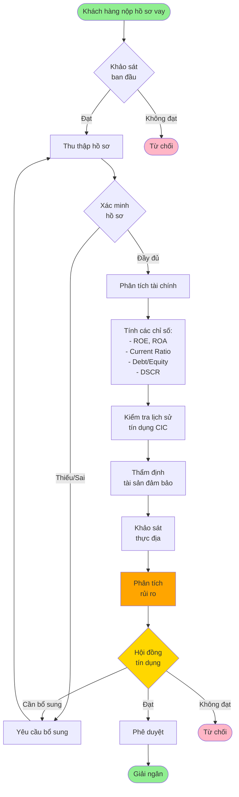
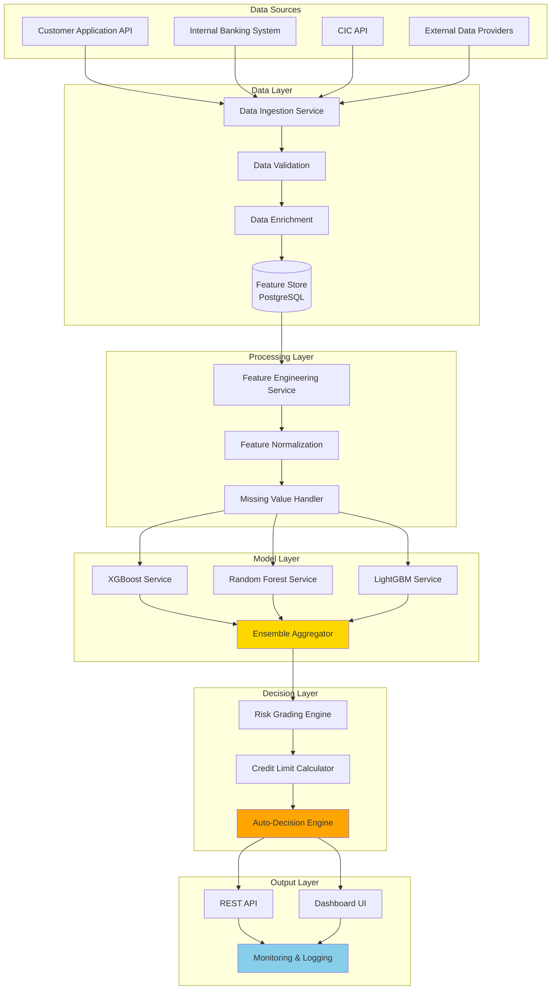

# Stage 2: Automated Credit Scoring Pipeline - Implementation Plan

Kế hoạch thiết kế hệ thống chấm điểm tín dụng tự động cho SME với khả năng xử lý thời gian thực và mở rộng.

> [!NOTE]
> **Vai trò tài liệu**: Đây là kế hoạch tư vấn (advisory plan). Người thực hiện sẽ tự triển khai dựa trên hướng dẫn này.

## Phạm vi & Ràng buộc Hệ thống

### Giới hạn Địa lý
- **Khu vực**: Chỉ áp dụng cho **Thành phố Hồ Chí Minh**
- **Lý do**: Đề tài nghiên cứu tập trung vào các ngân hàng thương mại tại TP.HCM
- **Impact**: 
  - Dữ liệu địa lý (province_code) sẽ cố định là HCMC
  - Có thể tận dụng dữ liệu kinh tế vĩ mô đặc thù của TP.HCM
  - Location risk score có thể chi tiết đến cấp quận/huyện trong HCM

### Giới hạn Ngành nghề
- **Scope hiện tại**: **Chưa giới hạn ngành nghề cụ thể**
- **Recommend**: Khi triển khai thực tế, nên ưu tiên các ngành:
  - Thương mại (Bán lẻ, Bán sỉ)
  - Sản xuất quy mô nhỏ
  - Dịch vụ (F&B, Logistics)
  - Xuất nhập khẩu

### Quy mô SME
- Doanh nghiệp vừa và nhỏ theo Nghị định 39/2018/NĐ-CP
- Doanh thu: < 200 tỷ VNĐ/năm
- Số lao động: < 200 người

## Mục tiêu toán học

Tìm hàm ánh xạ tối ưu:

```
ŷ = f(X_financial, X_alternative, X_demographic)
```

Trong đó:
- **ŷ**: Xác suất vỡ nợ (Probability of Default - PD)
- **X**: Các vector đặc trưng đã được số hóa

---

## 1. Quy trình Thẩm định Tín dụng Chuẩn (Thực tế)

### Flowchart Quy trình Truyền thống



### Các điểm ra quyết định chính

1. **Khảo sát ban đầu**: Lọc sơ bộ khách hàng không đủ điều kiện
2. **Xác minh hồ sơ**: Kiểm tra tính đầy đủ và hợp lệ
3. **Phân tích chỉ số tài chính**: Đánh giá năng lực tài chính
4. **Lịch sử tín dụng**: Kiểm tra CIC, nợ xấu
5. **Tài sản đảm bảo**: Thẩm định giá trị TSĐB
6. **Hội đồng tín dụng**: Quyết định cuối cùng

### Thời gian xử lý truyền thống: **5-15 ngày làm việc**

---

## 2. Quy trình Thẩm định Tín dụng Tự động

### Flowchart Quy trình Tự động hóa


### Thời gian xử lý tự động: **< 5 phút** (Near Real-time)

---

## 3. Lựa chọn Đặc trưng (Feature Selection)

### 3.1. X_financial (Đặc trưng Tài chính)

#### Từ Báo cáo tài chính

| Feature | Công thức | Ý nghĩa |
|---------|-----------|---------|
| `revenue_growth` | `(Doanh thu năm n - Doanh thu năm n-1) / Doanh thu năm n-1` | Tốc độ tăng trưởng |
| `profit_margin` | `Lợi nhuận ròng / Doanh thu` | Khả năng sinh lời |
| `roa` | `Lợi nhuận ròng / Tổng tài sản` | Hiệu quả sử dụng tài sản |
| `roe` | `Lợi nhuận ròng / Vốn chủ sở hữu` | Hiệu suất vốn |
| `current_ratio` | `Tài sản ngắn hạn / Nợ ngắn hạn` | Khả năng thanh toán |
| `quick_ratio` | `(TSNH - Hàng tồn kho) / Nợ ngắn hạn` | Thanh khoản nhanh |
| `debt_to_equity` | `Tổng nợ / Vốn chủ sở hữu` | Đòn bẩy tài chính |
| `debt_to_asset` | `Tổng nợ / Tổng tài sản` | Tỷ lệ nợ |
| `dscr` | `EBITDA / Tổng nghĩa vụ nợ hàng năm` | Khả năng trả nợ |
| `inventory_turnover` | `Giá vốn hàng bán / Hàng tồn kho TB` | Hiệu quả quản lý HTK |
| `receivable_turnover` | `Doanh thu / Khoản phải thu TB` | Hiệu quả thu hồi công nợ |
| `asset_turnover` | `Doanh thu / Tổng tài sản` | Hiệu quả sử dụng TS |

#### Từ Tài khoản giao dịch

| Feature | Mô tả | Công thức |
|---------|-------|-----------|
| `avg_daily_balance` | Số dư bình quân ngày (3 tháng) | `Σ(Số dư cuối ngày) / Số ngày` |
| `min_balance_3m` | Số dư thấp nhất 3 tháng | `min(số dư)` |
| `cash_flow_volatility` | Độ biến động dòng tiền | `std(dòng tiền hàng ngày)` |
| `avg_monthly_deposits` | Tiền gửi TB/tháng | `Σ(Tiền gửi) / 3` |
| `avg_monthly_withdrawals` | Tiền rút TB/tháng | `Σ(Tiền rút) / 3` |
| `net_cash_flow` | Dòng tiền ròng TB/tháng | `avg_deposits - avg_withdrawals` |
| `num_transactions_3m` | Số giao dịch 3 tháng | `count(transactions)` |
| `overdraft_count` | Số lần thấu chi | `count(balance < 0)` |

### 3.2. X_alternative (Đặc trưng Thay thế)

#### Lịch sử Tín dụng (CIC)

| Feature | Mô tả |
|---------|-------|
| `cic_score` | Điểm CIC (nếu có) |
| `num_active_loans` | Số khoản vay đang có |
| `total_outstanding_debt` | Tổng dư nợ hiện tại |
| `max_past_due_days` | Số ngày quá hạn cao nhất (12 tháng) |
| `num_past_due_30d` | Số lần quá hạn > 30 ngày (12 tháng) |
| `num_past_due_90d` | Số lần quá hạn > 90 ngày (12 tháng) |
| `debt_burden_ratio` | `Tổng dư nợ / Doanh thu tháng` |
| `credit_history_length` | Số năm có quan hệ tín dụng |

#### Dữ liệu Hành vi & Hoạt động

| Feature | Mô tả |
|---------|-------|
| `business_age` | Số năm hoạt động của doanh nghiệp |
| `num_employees` | Số lượng nhân viên |
| `ownership_stability` | Tỷ lệ sở hữu ổn định (không đổi chủ) |
| `industry_risk_score` | Điểm rủi ro ngành nghề (tra bảng) |
| `district_risk_score` | Điểm rủi ro theo quận/huyện HCM (1-10) |
| `district_business_density` | Mật độ DN trong quận (DN/km²) |
| `avg_income_district` | Thu nhập bình quân quận (VNĐ/tháng) |
| `digital_footprint` | Mức độ hiện diện số (website, social) |
| `supplier_relationships` | Số nhà cung cấp chính |
| `customer_concentration` | Tỷ trọng KH lớn nhất / Doanh thu |

**Bảng District Risk Score cho TP.HCM** (ví dụ minh họa):

| Quận/Huyện | Risk Score | Lý do |
|------------|------------|-------|
| Q1, Q3, Q7, Bình Thạnh | 1-2 (Thấp) | Trung tâm kinh tế, thanh khoản cao |
| Q2, Q9, Thủ Đức | 3-4 (TB-Thấp) | Khu công nghiệp, phát triển |
| Q4, Q5, Q6, Q8, Q10, Q11 | 4-5 (Trung bình) | Khu vực ổn định |
| Bình Tân, Tân Phú, Gò Vấp | 5-6 (TB) | Phát triển công nghiệp nhẹ |
| Hóc Môn, Củ Chi, Nhà Bè | 7-8 (TB-Cao) | Ngoại thành, nông nghiệp |
| Cần Giờ | 9-10 (Cao) | Xa trung tâm, du lịch sinh thái |

### 3.3. X_demographic (Đặc trưng Nhân khẩu & Pháp lý)

| Feature | Mô tả | Kiểu | Ghi chú (HCMC scope) |
|---------|-------|------|----------------------|
| `business_type` | Loại hình DN (TNHH, CP, Tư nhân) | Categorical | - |
| `industry_code` | Mã ngành VSIC | Categorical | Tất cả ngành |
| `district_code` | Mã quận/huyện TP.HCM | Categorical | 24 quận/huyện HCM |
| `business_zone` | Khu vực KD (CBD, Ngoại thành) | Categorical | CBD: Q1,3,4,5,10,11 |
| `registered_capital` | Vốn điều lệ | Numeric | - |
| `owner_age` | Tuổi chủ doanh nghiệp | Numeric | - |
| `owner_education` | Trình độ học vấn | Categorical | - |
| `owner_experience` | Số năm kinh nghiệm | Numeric | - |
| `has_collateral` | Có TSĐB hay không | Binary | - |
| `collateral_value` | Giá trị TSĐB | Numeric | - |
| `collateral_location` | Vị trí TSĐB (quận/huyện) | Categorical | Ảnh hưởng giá trị |
| `loan_to_value` | `Hạn mức vay / Giá trị TSĐB` | Numeric | - |

---

## 4. Feature Engineering & Normalization

### 4.1. Biến đổi dữ liệu

#### Log Transform (cho biến lệch phải)
Áp dụng log transformation cho các biến có phân phối lệch phải như doanh thu, tổng tài sản, vốn điều lệ.

#### Tỷ lệ & Tương tác
Tạo các biến tương tác giữa các chỉ số tài chính để nắm bắt mối quan hệ phi tuyến.

### 4.2. Chuẩn hóa (Normalization)

#### Min-Max Scaling (cho features có phân phối đồng đều)
Scale các features về khoảng [0, 1].

#### Standardization (cho features có phân phối chuẩn)
```python
z = (x - μ) / σ
```

Chuẩn hóa features theo phân phối chuẩn với mean = 0, std = 1.

### 4.3. Xử lý Missing Values

- Median imputation cho numeric features
- Mode imputation cho categorical features
- Xem xét KNN imputation cho missing values có cấu trúc

---

## 5. Kiến trúc Mô hình (Model Architecture)

### 5.1. Base Models

#### XGBoost
Gradient boosting framework với khả năng xử lý imbalanced data tốt.
- Hyperparameters: n_estimators, max_depth, learning_rate, subsample
- Objective: binary:logistic
- Evaluation metric: AUC

#### Random Forest
Ensemble của decision trees với khả năng chống overfitting.
- Hyperparameters: n_estimators, max_depth, min_samples_split
- Class weight: balanced để xử lý imbalanced data

#### LightGBM
Gradient boosting framework tối ưu cho tốc độ và hiệu suất.
- Hyperparameters: n_estimators, max_depth, learning_rate, num_leaves
- Ưu điểm: Nhanh, hiệu quả với dữ liệu lớn

### 5.2. Ensemble Strategy

#### Weighted Average Ensemble
Kết hợp predictions từ nhiều models với weights được tối ưu hóa.
- Tính PD cuối cùng: ŷ = w1 * P_xgb + w2 * P_rf + w3 * P_lgbm
- Weights được học qua validation set

#### Stacking Ensemble
Sử dụng meta-model (Logistic Regression) để học cách kết hợp predictions.


### 5.3. Hàm dự đoán cuối cùng

**Input**: X_financial, X_alternative, X_demographic

**Output**: 
- `pd_score`: Probability of Default [0, 1]
- `risk_grade`: 'Low', 'Medium', 'High'
- `credit_limit`: Hạn mức đề xuất
- `recommendation`: Quyết định (Auto-Approve/Manual Review/Auto-Reject)

**Pipeline**:
1. Concatenate features từ 3 nguồn
2. Feature engineering & transformation
3. Normalization
4. Predict với ensemble model
5. Risk grading dựa trên PD threshold

---

## 6. Kiến trúc Hệ thống

### 6.1. System Architecture



### 6.2. Technology Stack

| Component | Technology | Lý do |
|-----------|-----------|-------|
| **API Gateway** | FastAPI / Flask | High performance, async support |
| **Feature Store** | PostgreSQL + Redis | Persistence + Caching |
| **ML Framework** | Scikit-learn, XGBoost, LightGBM | Industry standard |
| **Model Serving** | MLflow / BentoML | Version control & deployment |
| **Message Queue** | RabbitMQ / Kafka | Async processing, scalability |
| **Monitoring** | Prometheus + Grafana | Real-time metrics |
| **Logging** | ELK Stack | Centralized logging |
| **Container** | Docker + Kubernetes | Orchestration & scaling |

---

## 7. Verification Plan

### 7.1. Automated Tests

#### Unit Tests
```bash
pytest tests/unit/test_feature_engineering.py
pytest tests/unit/test_model_prediction.py
pytest tests/unit/test_risk_grading.py
```

#### Integration Tests
```bash
pytest tests/integration/test_end_to_end_pipeline.py
```

#### Performance Tests
```bash
# Load test: 1000 concurrent requests
locust -f tests/load/locustfile.py --host=http://localhost:8000
```

### 7.2. Model Validation

| Metric | Target | Mô tả |
|--------|--------|-------|
| **AUC-ROC** | > 0.80 | Khả năng phân biệt default/non-default |
| **Precision** | > 0.75 | Độ chính xác khi dự đoán default |
| **Recall** | > 0.70 | Tỷ lệ phát hiện được default |
| **F1-Score** | > 0.72 | Cân bằng Precision & Recall |
| **KS Statistic** | > 0.40 | Khả năng phân tách phân phối |

### 7.3. Business Metrics

| Metric | Target | Hiện tại (Truyền thống) |
|--------|--------|-------------------------|
| **Processing Time** | < 5 phút | 5-15 ngày |
| **Auto-approval Rate** | 30-40% | 0% |
| **Manual Review Rate** | 40-50% | 100% |
| **Throughput** | 10,000 applications/day | ~100 applications/day |
| **Bad Debt Rate** | < 3% | 5-7% |

---

## Hướng dẫn Triển khai (Implementation Guidance)

### Bước 1: Chuẩn bị Dữ liệu (Data Preparation)

#### 1.1. Thu thập dữ liệu TP.HCM
- Dữ liệu DN SME từ Sở Kế hoạch & Đầu tư TP.HCM
- Báo cáo tài chính mẫu (nếu có từ ngân hàng)
- Dữ liệu CIC (nếu được cấp phép)
- Dữ liệu kinh tế vĩ mô HCM (GDP, thu nhập bình quân theo quận)

#### 1.2. Tạo Synthetic Data (nếu thiếu dữ liệu thực)
Sử dụng phân phối thống kê (lognormal, binomial) để tạo dữ liệu giả lập phù hợp với đặc điểm SME tại HCM.

### Bước 2: Xây dựng Feature Engineering Pipeline

Xây dựng class SMEFeatureEngineer để:
- Tính toán các chỉ số tài chính (ROA, Current Ratio, etc.)
- Ánh xạ điểm rủi ro theo quận/huyện
- Tạo các biến binary (is_cbd, has_collateral)
- Chuẩn hóa dữ liệu

### Bước 3: Training Model

**Quy trình**:
1. Split data (train/test) với stratification để giữ tỷ lệ default
2. Train base models (XGBoost, Random Forest, LightGBM) với hyperparameter tuning
3. Sử dụng early stopping để tránh overfitting
4. Evaluate trên test set với các metrics: AUC-ROC, Precision, Recall, F1-Score

### Bước 4: Deployment (Simple API)

**REST API sử dụng FastAPI**:
- Load trained model và feature engineer
- Nhận request với thông tin khách hàng
- Feature engineering tự động
- Predict PD score
- Risk grading và auto-decision
- Trả về kết quả JSON với pd_score, risk_grade, decision

---

## Checklist Triển khai

### Phase 1: Research & Design (1-2 tuần)
- [ ] Nghiên cứu thêm về credit scoring cho SME
- [ ] Thu thập dữ liệu thực tế (nếu có) hoặc chuẩn bị synthetic data
- [ ] Finalize feature list dựa trên dữ liệu có sẵn
- [ ] Thiết kế database schema cho feature store

### Phase 2: Development (3-4 tuần)
- [ ] Xây dựng feature engineering pipeline
- [ ] Train baseline models (XGBoost, Random Forest, LightGBM)
- [ ] Implement ensemble strategy
- [ ] Build prediction API

### Phase 3: Testing & Validation (1-2 tuần)
- [ ] Unit tests cho các components
- [ ] Validate model performance (AUC > 0.80)
- [ ] Load testing (throughput, latency)
- [ ] Documentation

### Phase 4: Demo & Presentation (1 tuần)
- [ ] Chuẩn bị demo với dữ liệu mẫu
- [ ] Tạo dashboard để visualize kết quả
- [ ] Viết báo cáo kỹ thuật
- [ ] Present cho thầy/hội đồng

---

## Tài nguyên Tham khảo

### Datasets
- **Public SME Default Datasets**: Kaggle, UCI Machine Learning Repository
- **Vietnam SME Data**: Tổng cục Thống kê, Sở KHĐT TP.HCM
- **Industry Benchmarks**: State Bank of Vietnam reports

### Papers & Resources
- "Credit Scoring for SMEs using Machine Learning" (various papers)
- Basel II/III guidelines on credit risk
- Vietnam Central Bank regulations on SME lending

### Tools & Libraries
**Core**: pandas, numpy, scikit-learn
**ML**: xgboost, lightgbm, random forest
**API**: fastapi, uvicorn
**MLOps**: mlflow (experiment tracking), shap (interpretability)

---

## Note cuối cùng

> [!IMPORTANT]
> Plan này là **advisory/tư vấn**. Bạn sẽ tự triển khai từng bước.
> 
> **Các điểm cần lưu ý khi thực hiện:**
> 1. Bắt đầu đơn giản với baseline model trước
> 2. Validate từng bước, đừng build toàn bộ hệ thống một lúc
> 3. Focus vào feature quality hơn là model complexity
> 4. Document mọi thứ để viết báo cáo sau
> 
> **Khi gặp vấn đề, hãy quay lại plan này và review từng bước.**

Chúc bạn triển khai thành công! 🚀
