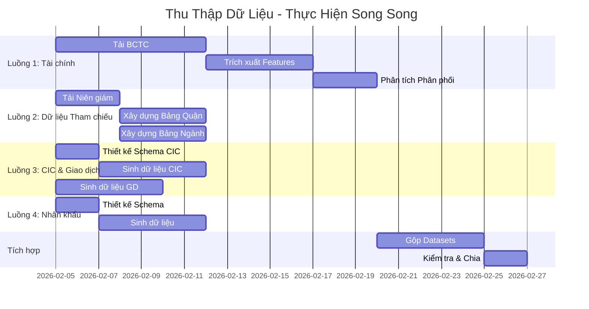

# Phân Chia Công Việc: Thu Thập Dữ Liệu - Kế Hoạch Thực Hiện Song Song

> [!NOTE]
> **Vai trò**: Kế hoạch Quản lý Dự án
> 
> Chia công việc thu thập dữ liệu thành **4 luồng công việc song song** để tối ưu thời gian.

---

## 🎯 Tổng Quan Chiến Lược

### Nguyên Tắc Phân Chia Công Việc
1. **Giảm thiểu phụ thuộc**: Công việc độc lập nhất có thể
2. **Cân bằng khối lượng**: Chia đều effort giữa các luồng
3. **Kết quả rõ ràng**: Mỗi task có output cụ thể
4. **Điểm hợp nhất**: Có checkpoint để merge kết quả

### Timeline Tổng Thể
- **Thời lượng**: 6 tuần (giảm từ 10 tuần nhờ song song hóa)
- **Luồng song song**: 4 luồng đồng thời
- **Điểm merge**: Tuần 5-6

---

## 📋 4 Luồng Công Việc Song Song



---

## 🔵 Luồng 1: Dữ Liệu Tài Chính (BCTC)

**Người phụ trách**: Thành viên A
**Thời gian**: 3 tuần
**Kết quả**: `financial_features_10k.csv` + `distribution_params.json`

### Công việc 1.1: Tải BCTC từ UPCOM (Tuần 1)
**Công sức**: 1 tuần | **Song song được**: ✅ Có

**Công việc con**:
- [ ] T1.1.1: Nghiên cứu danh sách công ty UPCOM
  - Truy cập: https://www.hnx.vn/vi-vn/cong-ty-dai-chung.html
  - Lọc: Doanh thu < 200 tỷ, TP.HCM
  - Dự kiến: 150-200 công ty
  - **Kết quả**: `upcom_company_list.csv`

- [ ] T1.1.2: Xây dựng script tải tự động
  - Công cụ: Python + requests/selenium
  - Website mục tiêu: VietStock, CafeF
  - **Kết quả**: `download_bctc.py`

- [ ] T1.1.3: Tải BCTC nhóm 1 (50 công ty)
  - Tự động hóa download
  - Lưu vào: `data/raw/bctc/batch1/`
  
- [ ] T1.1.4: Tải BCTC nhóm 2 (50 công ty)
  - Song song với T1.1.3
  - Lưu vào: `data/raw/bctc/batch2/`
  
- [ ] T1.1.5: Tải BCTC nhóm 3 (50 công ty)
  - Song song với T1.1.3, T1.1.4
  - Lưu vào: `data/raw/bctc/batch3/`

- [ ] T1.1.6: Tải BCTC nhóm 4 (50 công ty)
  - Song song với các nhóm trên
  - Lưu vào: `data/raw/bctc/batch4/`

**Checkpoint**: 200 công ty × 5 năm = 1000 file BCTC

### Công việc 1.2: Trích Xuất Đặc Trưng (Tuần 2)
**Công sức**: 5 ngày | **Phụ thuộc**: T1.1

**Công việc con**:
- [ ] T1.2.1: Xây dựng script trích xuất
  - Chuyển đổi Excel/PDF sang dữ liệu có cấu trúc
  - Trích xuất: Tài sản, Nợ, Vốn CSH, Doanh thu, Lợi nhuận
  - **Kết quả**: `extract_features.py`

- [ ] T1.2.2: Trích xuất nhóm 1-2
  - Xử lý 100 công ty
  - QA: Kiểm tra giá trị thiếu
  
- [ ] T1.2.3: Trích xuất nhóm 3-4
  - Song song với T1.2.2
  - Xử lý 100 công ty

- [ ] T1.2.4: Tính 12 chỉ số tài chính
  - ROA, ROE, Current Ratio, v.v.
  - **Kết quả**: `financial_features_real.csv`

**Checkpoint**: Dataset với 12 features × 200 công ty × 5 năm = 12K dòng

### Công việc 1.3: Phân Tích Phân Phối (Tuần 3)
**Công sức**: 3 ngày | **Phụ thuộc**: T1.2

**Công việc con**:
- [ ] T1.3.1: Phân tích khám phá dữ liệu
  - Vẽ biểu đồ phân phối
  - Phát hiện outliers
  - **Kết quả**: `eda_financial.ipynb`

- [ ] T1.3.2: Fit phân phối
  - Test: Normal, Lognormal, Gamma
  - Chọn best fit (KS-test)
  - **Kết quả**: `distribution_params.json`

- [ ] T1.3.3: Ước lượng ma trận tương quan
  - Tính covariance
  - Kiểm tra tương quan hợp lý
  - **Kết quả**: `correlation_matrix.csv`

- [ ] T1.3.4: Sinh 10,000 mẫu synthetic
  - Sử dụng tham số đã học
  - Duy trì tương quan
  - **Kết quả**: `synthetic_financial_10k.csv`

---

## 🟢 Luồng 2: Dữ Liệu Tham Chiếu (Công khai)

**Người phụ trách**: Thành viên B
**Thời gian**: 1 tuần
**Kết quả**: `district_lookup.csv` + `industry_risk.csv`

### Công việc 2.1: Dữ Liệu Quận (3 ngày)
**Công sức**: 3 ngày | **Song song được**: ✅ Có

**Công việc con**:
- [ ] T2.1.1: Tải Niên giám Thống kê TP.HCM
  - Nguồn: http://www.pso.hochiminhcity.gov.vn/
  - File: "Niên giám thống kê 2024" (PDF)
  - **Kết quả**: `nien_giam_hcm_2024.pdf`

- [ ] T2.1.2: Trích xuất bảng từ PDF
  - Công cụ: Tabula, pdfplumber
  - Bảng: Số DN/quận, Diện tích, Thu nhập
  - **Kết quả**: `raw_tables/`

- [ ] T2.1.3: Xây dựng bảng tra cứu quận
  - 24 quận TP.HCM
  - Cột: district_code, name, area_km2, num_businesses, avg_income, business_density
  - **Kết quả**: `district_lookup.csv`

- [ ] T2.1.4: Tính điểm rủi ro quận
  - Công thức: Dựa trên business_density + avg_income
  - Thang điểm: 1-10
  - **Kết quả**: Cập nhật `district_lookup.csv` với cột risk_score

### Công việc 2.2: Rủi Ro Ngành (4 ngày)
**Công sức**: 4 ngày | **Song song được**: ✅ Có (với T2.1)

**Công việc con**:
- [ ] T2.2.1: Nghiên cứu tỷ lệ vỡ nợ theo ngành
  - Nguồn: Báo cáo NHNN, SSI Research
  - Tập trung: 10-15 ngành phổ biến SME
  - **Kết quả**: `industry_research_notes.md`

- [ ] T2.2.2: Xây dựng bảng ánh xạ ngành
  - Mã VSIC
  - Tên ngành (Tiếng Việt)
  - **Kết quả**: `vsic_mapping.csv`

- [ ] T2.2.3: Gán điểm rủi ro (1-10)
  - Dựa trên: độ biến động, tác động COVID, rào cản
  - Đánh giá chủ quan + nghiên cứu
  - **Kết quả**: `industry_risk.csv`

- [ ] T2.2.4: Kiểm chứng với tài liệu
  - Đối chiếu với báo cáo công khai
  - Ghi chép giả định

---

## 🟡 Luồng 3: Synthetic CIC & Giao Dịch

**Người phụ trách**: Thành viên C
**Thời gian**: 1 tuần
**Kết quả**: `synthetic_cic_8features.csv` + `synthetic_transaction_8features.csv`

### Công việc 3.1: Đặc Trưng CIC (5 ngày)
**Công sức**: 5 ngày | **Song song được**: ✅ Có

**Công việc con**:
- [ ] T3.1.1: Thiết kế schema CIC
  - 8 đặc trưng: cic_score, num_active_loans, outstanding_debt, v.v.
  - Định nghĩa phân phối từ tài liệu
  - **Kết quả**: `cic_schema.yaml`

- [ ] T3.1.2: Sinh đặc trưng cơ bản
  - cic_score: Normal(650, 50)
  - num_active_loans: Poisson(λ=1.5)
  - **Kết quả**: Script `generate_cic.py`

- [ ] T3.1.3: Sinh đặc trưng dẫn xuất
  - debt_burden_ratio từ outstanding_debt
  - Áp dụng quy tắc: 5% có quá hạn
  
- [ ] T3.1.4: Sinh 10,000 mẫu
  - Tương quan với revenue (từ Luồng 1)
  - **Kết quả**: `synthetic_cic_10k.csv`

### Công việc 3.2: Đặc Trưng Giao Dịch (5 ngày)
**Công sức**: 5 ngày | **Song song được**: ✅ Có (với T3.1)

**Công việc con**:
- [ ] T3.2.1: Thiết kế schema giao dịch
  - 8 đặc trưng: avg_balance, cash_flow_volatility, v.v.
  - **Kết quả**: `transaction_schema.yaml`

- [ ] T3.2.2: Sinh features liên quan số dư
  - avg_daily_balance: Tương quan với revenue
  - min_balance_3m: phần của avg_balance
  
- [ ] T3.2.3: Sinh số lượng giao dịch
  - num_transactions: Dựa vào quy mô DN
  - overdraft_count: Binomial(p=0.1)

- [ ] T3.2.4: Sinh 10,000 mẫu
  - **Kết quả**: `synthetic_transaction_10k.csv`

---

## 🟣 Luồng 4: Đặc Trưng Nhân Khẩu

**Người phụ trách**: Thành viên D (hoặc A nếu 3 người)
**Thời gian**: 1 tuần
**Kết quả**: `synthetic_demographic_12features.csv`

### Công việc 4.1: Đặc Trưng Phân Loại (3 ngày)
**Công sức**: 3 ngày | **Song song được**: ✅ Có

**Công việc con**:
- [ ] T4.1.1: Thiết kế schema
  - Danh sách 12 đặc trưng
  - Đặc tả phân phối
  - **Kết quả**: `demographic_schema.yaml`

- [ ] T4.1.2: Sinh categorical
  - business_type: TNHH 60%, CP 30%, Tư nhân 10%
  - industry_code: Từ bảng industry_risk (Luồng 2)
  - district_code: Random 1-24
  - owner_education: ĐH 50%, CĐ 30%, THPT 20%

- [ ] T4.1.3: Sinh numeric
  - registered_capital: Lognormal(19, 1)
  - owner_age: Normal(42, 8)
  - owner_experience: Lognormal(2.5, 0.7)

### Công việc 4.2: Đặc Trưng Tài Sản Đảm Bảo (3 ngày)
**Công sức**: 3 ngày | **Song song được**: ✅ Có

**Công việc con**:
- [ ] T4.2.1: Sinh binary
  - has_collateral: Binomial(p=0.6)
  
- [ ] T4.2.2: Sinh có điều kiện
  - Nếu has_collateral: collateral_value = Lognormal(20.5, 1)
  - collateral_location: Cùng quận hoặc quận lân cận
  
- [ ] T4.2.3: Tính LTV
  - loan_to_value: Uniform(0.5, 0.8)
  - **Kết quả**: `synthetic_demographic_10k.csv`

---

## 🔄 Giai Đoạn Tích Hợp (Tuần 5-6)

**Người phụ trách**: Trưởng nhóm
**Thời gian**: 1-2 tuần
**Phụ thuộc**: Tất cả các luồng

### Công việc 5.1: Gộp Datasets (1 tuần)
**Công việc con**:
- [ ] T5.1.1: Kết hợp tất cả bộ đặc trưng
  - Tài chính (20) + CIC (8) + Giao dịch (8) + Hành vi (10) + Nhân khẩu (12)
  - Tổng: 58 đặc trưng
  - **Kết quả**: `combined_features_10k.csv`

- [ ] T5.1.2: Sinh biến mục tiêu (nhãn vỡ nợ)
  - Dựa trên quy tắc: 
    - Nếu PD_score_ước_lượng > ngưỡng → default = 1
    - Tỷ lệ cơ sở: 5%
  - **Kết quả**: Thêm cột `default`

- [ ] T5.1.3: Làm giàu với bảng tra cứu
  - Join district_lookup (Luồng 2)
  - Join industry_risk (Luồng 2)

### Công việc 5.2: Kiểm Tra & QA (3 ngày)
**Công việc con**:
- [ ] T5.2.1: Kiểm tra chất lượng dữ liệu
  - Giá trị thiếu < 5%
  - Phát hiện outliers
  - Kiểm tra phạm vi giá trị

- [ ] T5.2.2: Kiểm tra thống kê
  - Kiểm tra tương quan hợp lý
  - Tỷ lệ vỡ nợ ~5%
  - Phân phối features realistic

- [ ] T5.2.3: Tài liệu hóa
  - Data dictionary
  - Log các giả định
  - **Kết quả**: `data_documentation.md`

### Công việc 5.3: Chia & Xuất (2 ngày)
**Công việc con**:
- [ ] T5.3.1: Chia Train/Validation/Test
  - Train: 70% (7,000)
  - Validation: 15% (1,500)
  - Test: 15% (1,500)
  - Stratify theo nhãn default

- [ ] T5.3.2: Xuất datasets cuối cùng
  - **Kết quả**:
    - `train_7k.csv`
    - `val_1.5k.csv`
    - `test_1.5k.csv`
    - `full_10k.csv`

---

## 📊 Phân Bổ Nguồn Lực

### Nếu Nhóm 4 Người:

| Người | Luồng Công Việc | Công Sức | Kỹ Năng Cần |
|-------|-----------------|----------|-------------|
| **A** | Luồng 1: Tài chính | 3 tuần | Python, pandas, web scraping |
| **B** | Luồng 2: Dữ liệu Tham chiếu | 1 tuần (→ hỗ trợ Luồng 1 tuần 2-3) | Trích xuất PDF, nghiên cứu |
| **C** | Luồng 3: CIC & Giao dịch | 1 tuần (→ hỗ trợ Tích hợp tuần 2-3) | Thống kê, dữ liệu synthetic |
| **D** | Luồng 4: Nhân khẩu + Trưởng nhóm Tích hợp | 1 tuần + 2 tuần | Data engineering, QA |

### Nếu Nhóm 3 Người:

| Người | Luồng Công Việc | Tải Trọng |
|-------|-----------------|-----------|
| **A** | Luồng 1 (chính) + Luồng 4 (tuần 2) | 100% |
| **B** | Luồng 2 (tuần 1) + Tích hợp (tuần 2-3) | 100% |
| **C** | Luồng 3 (tuần 1) + Hỗ trợ Luồng 1 (tuần 2) + Tích hợp (tuần 3) | 100% |

### Nếu 1 Người (làm một mình):

**Cách tiếp cận tuần tự** (10 tuần):
1. Luồng 2 trước (1 tuần) - dễ nhất
2. Luồng 3 (1 tuần)
3. Luồng 4 (1 tuần)
4. Luồng 1 (3 tuần) - khó nhất
5. Tích hợp (2 tuần)

---

## ✅ Checkpoints & Mốc Quan Trọng

### Checkpoint 1: Cuối Tuần 1
**Tiêu chí**:
- ✅ Luồng 1: 200 file BCTC đã tải
- ✅ Luồng 2: Bảng Quận + Ngành hoàn thành
- ✅ Luồng 3: Schema CIC + Giao dịch đã thiết kế
- ✅ Luồng 4: Schema Nhân khẩu đã thiết kế

**Họp**: Review tính đầy đủ, điều chỉnh nếu cần

### Checkpoint 2: Cuối Tuần 3
**Tiêu chí**:
- ✅ Luồng 1: `synthetic_financial_10k.csv` sẵn sàng
- ✅ Luồng 2: Bảng tra cứu đã kiểm chứng
- ✅ Luồng 3: `synthetic_cic_10k.csv` + `synthetic_transaction_10k.csv` sẵn sàng
- ✅ Luồng 4: `synthetic_demographic_10k.csv` sẵn sàng

**Họp**: Review trước khi merge

### Mốc Cuối: Cuối Tuần 5-6
**Tiêu chí**:
- ✅ `final_dataset_10k.csv` với 58 đặc trưng
- ✅ Chia Train/Val/Test
- ✅ Tài liệu hoàn thành
- ✅ QA passed

**Ký duyệt**: Sẵn sàng cho training model

---

## 🛠️ Công Cụ & Thiết Lập

### Công Cụ Chung (Tất cả luồng)
```bash
# Môi trường Python
conda create -n credit_scoring python=3.10
conda activate credit_scoring

# Thư viện cốt lõi
pip install pandas numpy scipy scikit-learn
pip install matplotlib seaborn jupyter

# Luồng 1 cụ thể
pip install requests beautifulsoup4 selenium openpyxl

# Luồng 2 cụ thể
pip install tabula-py pdfplumber

# Luồng 3, 4
pip install faker  # Để tạo tên, địa chỉ realistic
```

### Cấu Trúc Repository Chung
```
data-acquisition/
├── luong1_tai_chinh/
│   ├── scripts/
│   ├── data/raw/
│   └── data/processed/
├── luong2_tham_chieu/
│   ├── scripts/
│   └── data/
├── luong3_cic_giaodich/
│   ├── scripts/
│   └── data/
├── luong4_nhan_khau/
│   ├── scripts/
│   └── data/
├── tich_hop/
│   ├── scripts/
│   └── data/final/
└── docs/
    └── data_dictionary.md
```

---

## 📝 Kế Hoạch Giao Tiếp

### Họp Hàng Ngày (15 phút)
- **Khi nào**: Mỗi sáng 9:00 AM
- **Định dạng**: 
  - Hôm qua: Đã hoàn thành gì
  - Hôm nay: Đang làm gì
  - Vấn đề: Có trở ngại nào

### Họp Hàng Tuần (30 phút)
- **Khi nào**: Cuối mỗi tuần
- **Nội dung**:
  - Review tiêu chí checkpoint
  - Demo tiến độ
  - Điều chỉnh timeline nếu cần

### Tài Liệu Chung
- **Google Sheets**: Theo dõi tiến độ (% hoàn thành mỗi task)
- **Slack/Discord**: Câu hỏi nhanh
- **GitHub Issues**: Theo dõi bug, câu hỏi kỹ thuật

---

## 🚨 Giảm Thiểu Rủi Ro

| Rủi Ro | Tác Động | Biện Pháp Giảm Thiểu |
|---------|----------|----------------------|
| VietStock giới hạn tốc độ | Trễ Luồng 1 | Dùng nhiều nguồn (CafeF, Fireant), throttle requests |
| BCTC thiếu dữ liệu | Chất lượng thấp | Chấp nhận 80% đầy đủ, nội suy giá trị thiếu |
| Tương quan không realistic | Model kém | Kiểm chứng với chuyên gia, điều chỉnh quy tắc |
| Một người bị block | Trượt timeline | Đào tạo chéo, buffer time ở tuần 6 |

---

## 📈 Chỉ Số Thành Công

- [ ] **Đầy đủ**: ≥ 95% trong 10,000 mẫu có đủ 58 đặc trưng
- [ ] **Chất lượng**: Giá trị thiếu < 5% mỗi đặc trưng
- [ ] **Thực tế**: Phân phối khớp với tài liệu (KS-test p > 0.05)
- [ ] **Cân bằng**: Tỷ lệ vỡ nợ = 5% ± 1%
- [ ] **Timeline**: Hoàn thành trong 6 tuần

---

## 🎓 Gợi Ý Phân Công Theo Số Người

### Nhóm 4 người - KHUYẾN NGHỊ
- **Ưu điểm**: Mỗi người tập trung 1 luồng, chuyên môn hóa cao
- **Timeline**: 6 tuần
- **Hiệu quả**: Cao nhất

### Nhóm 3 người - KHẢ THI
- **Ưu điểm**: Vẫn song song được, linh hoạt
- **Timeline**: 6-7 tuần
- **Hiệu quả**: Tốt

### Nhóm 2 người - KHÓ
- **Phân công**: 
  - Người 1: Luồng 1 + Luồng 4
  - Người 2: Luồng 2 + Luồng 3 + Tích hợp
- **Timeline**: 8 tuần
- **Hiệu quả**: Trung bình

### 1 người - RẤT KHÓ
- **Cách**: Tuần tự, ưu tiên dễ → khó
- **Timeline**: 10 tuần
- **Hiệu quả**: Thấp nhưng vẫn hoàn thành được

---

Bạn có bao nhiêu người trong nhóm? Tôi sẽ customize chi tiết hơn cho trường hợp của bạn!
